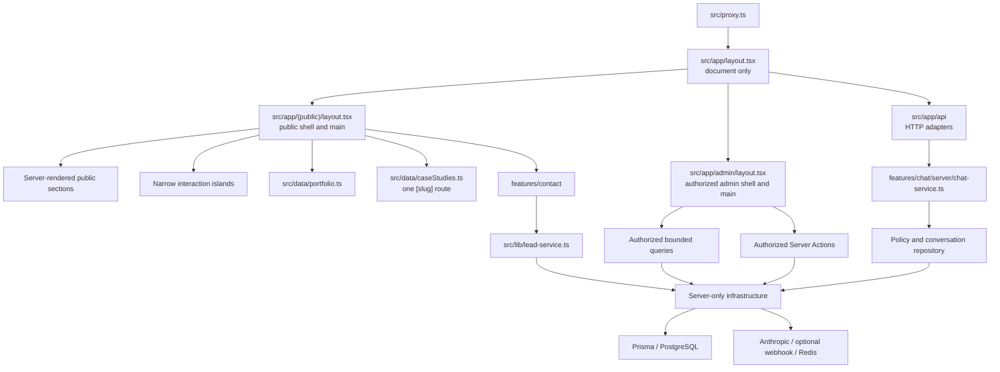

# Inside Dopamine — Phase 2.0 Architecture Refinement Review

**Original review date:** 2026-07-22

**Implementation status update:** 2026-07-23

**Scope:** Phase 2.0 architecture recommendations and completed Phase Two implementation

**Phase Two status:** COMPLETE

**UI/UX redesign readiness:** READY

**Production readiness:** BLOCKED separately by [CLEAN.md](CLEAN.md)

## 1. Executive summary

The Phase 2.0 review originally concluded that the repository had a sound Phase One engineering core but should not begin direct visual redesign until five architecture blockers were addressed. Phase Two completed those blocker-removal scopes without a framework rewrite or behavioral redesign:

1. Public and admin shells now have separate owners.
2. Product Engineering, Business Intelligence, and Growth now have one typed client-safe registry.
3. One dynamic route owns every current case-study detail URL.
4. The nine prioritized stable presentation modules render as Server Components.
5. Tailwind v4 CSS-first tokens, named widths, and normalized primitives now form the authoritative design-system foundation.

The supporting work also moved admin initial reads to the server, bounded lead/conversation lists, introduced a durable transcript count, corrected contact ownership, extracted the chat application service, repaired App Router route contracts, and enforced protected server-module dependency direction.

### Overall architecture score

**Current score: 8.5/10**

This score reflects route/content ownership, rendering boundaries, data access, dependency direction, design-system authority, scalability, and automated characterization. It is not a security or production-readiness score. The remaining deductions are for unresolved personalisation/recommendation ownership, dead presentation experiments, incomplete compatibility-alias adoption, and inconsistent legacy motion imports.

### Recommendation status

| Status | Count |
| --- | ---: |
| Completed | 10 |
| Partially Complete | 2 |
| Remaining | 2 |
| **Total** | **14** |

### Current residual risk

| Current risk | Count | Findings |
| --- | ---: | --- |
| Critical | 0 | — |
| High | 0 | — |
| Medium | 2 | H-05 residual adoption; M-05 ownership decision |
| Low | 2 | L-01 dead presentation; L-02 motion policy |

The original finding identifiers retain their historical severity prefix. “Current residual risk” is the post-implementation assessment.

The full implementation chronology is in [CHANGELOG.md](CHANGELOG.md#2026-07-23--phase-two-architecture-refinement-complete), current evidence/risk is in [AUDIT.md](AUDIT.md), and accepted repository rules are in [CLEAN.md](CLEAN.md).

## 2. Current architecture map



### Ownership by area

| Area | Canonical owner | Current shape |
| --- | --- | --- |
| Document | [`src/app/layout.tsx`](src/app/layout.tsx) | Server Component; HTML, font, global CSS, and root metadata only |
| Public shell | [`src/app/(public)/layout.tsx`](<src/app/(public)/layout.tsx>) | Public nav, transition, main, scroll control, footer, and chat |
| Admin shell | [`src/app/admin/layout.tsx`](src/app/admin/layout.tsx) | `force-dynamic`, authorization, admin header/nav/content/main |
| Case-study details | [`src/app/(public)/work/[slug]/page.tsx`](<src/app/(public)/work/[slug]/page.tsx>) | Sole route owner with finite static params and metadata |
| Portfolio taxonomy | [`src/data/portfolio.ts`](src/data/portfolio.ts) | Client-safe categories, services, relations, options, and route/card/navigation projections |
| Case-study content | [`src/data/caseStudies.ts`](src/data/caseStudies.ts) | Typed copy/content records |
| Contact | [`src/features/contact`](src/features/contact) | Server composition/action, client-safe contract, narrow client form |
| Chat | [`src/features/chat/server`](src/features/chat/server) | Application service, policy, result types, optimistic persistence |
| Admin collections | [`src/app/admin/leads/queries.ts`](src/app/admin/leads/queries.ts), [`src/app/admin/conversations/queries.ts`](src/app/admin/conversations/queries.ts) | Authorized, bounded, deterministic, narrow DTOs |
| Design system | [`src/styles/globals.css`](src/styles/globals.css), [`src/components/ui`](src/components/ui) | Tailwind v4 CSS-first tokens and domain-neutral primitives |
| Server core | [`src/lib/server/public-api-core.ts`](src/lib/server/public-api-core.ts) plus protected `src/lib` modules | Explicit server-only infrastructure; transport-neutral core separated from Next response construction |
| Persistence | [`prisma/schema.prisma`](prisma/schema.prisma), [`prisma/migrations`](prisma/migrations) | Reviewed schema/migrations, including durable constrained message counts |
| Architecture enforcement | [`tests/server-boundaries.test.ts`](tests/server-boundaries.test.ts) | TypeScript-AST dependency graph checks |

### Route and rendering map

| Route family | Rendering/data behavior | Ownership result |
| --- | --- | --- |
| `/`, `/about`, `/process`, `/privacy`, `/terms`, `/work` | Static Server Component composition with small public-shell islands | Preserved and no longer inside admin |
| `/contact` | Server composition plus a narrow `useActionState` form island | Feature-owned |
| `/services` | Server route with request-header ordering and client accordion on home | Taxonomy centralized; personalisation ownership remains M-05 |
| `/services/*` | Three existing static detail routes | URLs/content preserved; repeated template consolidation remains future work |
| `/work/[slug]` | Static params for three known slugs, metadata, native disclosure, related recommendation | Sole case-study detail owner |
| `/admin/leads` | Dynamic authorized Server Component, filters and cursor pagination | Bounded list; full lead detail route remains separate |
| `/admin/conversations` | Dynamic authorized Server Component and cursor pagination | Uses durable `messageCount`, not transcript JSON |
| `/admin/faqs` | Dynamic authorized Server Component plus client editor | Initial data server-loaded; mutations update returned DTOs/revalidate |
| `/api/chat` | Dynamic no-store HTTP adapter | Chat service owns orchestration |
| Other `/api/*` | Dynamic bounded route handlers and adjacent protected parsers | App Router export contract repaired |

## 3. Strengths

The following should continue to be preserved:

- **Server-first foundation.** Route entries and stable content default to Server Components.
- **Clear shell ownership.** Public and admin chrome no longer overlap, and each surface has one main.
- **Finite typed portfolio.** Stable keys and static projections can scale Product Engineering, BI, and Growth without parallel arrays.
- **One canonical case-study route.** Content, metadata, sitemap, static generation, and related behavior have one route owner.
- **Accepted Phase One safety contracts.** Point-of-use authorization, strict request validation, rate limits, truthful lead success, idempotency, optimistic chat persistence, safe errors, and redacted diagnostics remain intact.
- **Feature-sized ownership.** Contact and chat gained boundaries where ownership was demonstrably weak; the repository did not create a generic feature framework.
- **Bounded admin data.** Composite cursors and narrow DTOs prevent collection growth from expanding payloads without limit.
- **Durable conversation summary.** `messageCount` is maintained with transcript writes and constrained at the database layer.
- **CSS-first design foundation.** Tokens, widths, primitives, and compatibility tracking are testable and Tailwind-native.
- **Executable architecture rules.** Static tests validate the dependency graph rather than relying only on documentation.
- **Strong regression baseline.** The suite is now 21 files / 220 tests, up from the Phase One baseline of 12 files / 148 tests.

## 4. Findings grouped by original severity

The following subsections update every original recommendation. “Suggested execution order” records either the completed Phase Two sequence or the recommended Phase Three order for residual work.

### Critical

No Critical architecture finding existed and none is introduced by this update.

### High

#### H-01 — Public and admin route shells had the same root owner

- **Status:** **Completed**
- **Original severity:** High
- **Current residual risk:** None
- **Exact paths:** [`src/app/layout.tsx`](src/app/layout.tsx); [`src/app/(public)/layout.tsx`](<src/app/(public)/layout.tsx>); [`src/app/admin/layout.tsx`](src/app/admin/layout.tsx)
- **Why it matters:** Public transition, footer, scroll control, and chat no longer hydrate or render inside protected admin pages. Each surface owns one semantic main.
- **Implemented correction:** Root became document-only; public routes moved under a URL-preserving route group; admin owns its complete protected shell.
- **Implementation risk:** Closed. Characterization preserved metadata, animations, authentication, URLs, and Phase One behavior.
- **Suggested execution order:** Completed first in Phase 2.1A.

#### H-02 — Product, BI, and Growth portfolio content had no canonical taxonomy

- **Status:** **Completed**
- **Original severity:** High
- **Current residual risk:** None
- **Exact paths:** [`src/data/portfolio.ts`](src/data/portfolio.ts); [`src/data/caseStudies.ts`](src/data/caseStudies.ts); [`src/lib/segments.ts`](src/lib/segments.ts); [`src/features/contact/contract.ts`](src/features/contact/contract.ts); [`src/app/sitemap.ts`](src/app/sitemap.ts)
- **Why it matters:** Stable `product`, `bi`, and `growth` identities now connect services, case-study relations, navigation/cards, contact options, internal routes, and sitemap projections without server-only imports.
- **Implemented correction:** Added a small typed client-safe registry and migrated demonstrated duplicate owners.
- **Implementation risk:** Closed. Existing URLs/copy/slugs/metadata/server validation remained unchanged; no Growth detail route or invented case study was added.
- **Suggested execution order:** Completed in Phase 2.1C after shell/route ownership.

#### H-03 — Current case studies had duplicate explicit and dynamic route owners

- **Status:** **Completed**
- **Original severity:** High
- **Current residual risk:** None
- **Exact paths:** [`src/app/(public)/work/[slug]/page.tsx`](<src/app/(public)/work/[slug]/page.tsx>); deleted duplicate pages formerly under `work/ai-knowledge-copilot`, `work/executive-sales-dashboard`, and `work/operations-data-platform`; [`tests/case-study-routes.test.tsx`](tests/case-study-routes.test.tsx)
- **Why it matters:** Metadata, render behavior, related work, and static generation can no longer drift between competing route implementations.
- **Implemented correction:** The dynamic segment is the sole owner; it preserves `generateStaticParams`, `dynamicParams = false`, canonical/Open Graph metadata, known URLs, sitemap inclusion, and unknown-slug 404 behavior.
- **Implementation risk:** Closed through focused route characterization and production route-table verification.
- **Suggested execution order:** Completed in Phase 2.1B before content/design work.

#### H-04 — Static presentation used broad Client Component boundaries

- **Status:** **Completed** for the reviewed stable-presentation scope
- **Original severity:** High
- **Current residual risk:** None under H-04; the dynamic recommendation client belongs to M-05
- **Exact paths:** [`src/components/sections/HeroSection.tsx`](src/components/sections/HeroSection.tsx); `TrustStripSection.tsx`; `WorkSection.tsx`; `ProcessSection.tsx`; `ObjectionHandlingSection.tsx`; `FinalCTASection.tsx`; `PageHero.tsx`; `PageCta.tsx`; `CaseStudyLayout.tsx`; [`src/styles/globals.css`](src/styles/globals.css); [`tests/server-presentation.test.tsx`](tests/server-presentation.test.tsx)
- **Why it matters:** Stable copy, cards, lists, headings, calls to action, native disclosures, and case-study content no longer require hydration just to reveal.
- **Implemented correction:** Removed client/motion dependencies from nine prioritized modules and implemented CSS reveal/fallback/reduced-motion behavior. `ServicesSection` remains an intentional accordion island.
- **Implementation risk:** Closed for the migrated scope. Existing visual, responsive, native details/summary, route, and content contracts are characterized.
- **Suggested execution order:** Completed in Phase 2.3A after design-system authority.

#### H-05 — The design-system foundation was not the authoritative styling path

- **Status:** **Partially Complete**
- **Original severity:** High
- **Current residual risk:** Medium
- **Exact paths:** [`src/styles/globals.css`](src/styles/globals.css); [`src/app/globals.css`](src/app/globals.css); [`src/components/ui`](src/components/ui); [`src/features/contact/components/ContactForm.tsx`](src/features/contact/components/ContactForm.tsx); [`src/app/admin/faqs/FAQEditor.tsx`](src/app/admin/faqs/FAQEditor.tsx); [`tests/design-system.test.ts`](tests/design-system.test.ts); deleted `tailwind.config.ts`
- **Why it matters:** The repository now has one token/theme source and named primitives/widths, so redesign work has a dependable foundation. Untouched routes still use compatibility aliases and manual arbitrary values.
- **Implemented correction:** Defined semantic colors, type, spacing, radii, elevation, motion, focus/state tokens, four container variants, and normalized form/status primitives; migrated representative public/admin surfaces; removed the competing Tailwind config.
- **Recommended remaining correction:** Migrate remaining surfaces as they are redesigned, prohibit new alias use, then remove aliases only after all consumers and visual/accessibility checks pass.
- **Implementation risk:** Medium. Global replacement would be visually risky; incremental route-by-route migration is the accepted approach.
- **Suggested execution order:** Phase Three priority 2, performed with the visual redesign rather than as a separate global rewrite.

### Medium

#### M-01 — The chat route was both HTTP adapter and application service

- **Status:** **Completed**
- **Original severity:** Medium
- **Current residual risk:** None
- **Exact paths:** [`src/app/api/chat/route.ts`](src/app/api/chat/route.ts); [`src/features/chat/server/chat-service.ts`](src/features/chat/server/chat-service.ts); [`src/features/chat/server/chat-policy.ts`](src/features/chat/server/chat-policy.ts); [`src/features/chat/server/conversation-repository.ts`](src/features/chat/server/conversation-repository.ts); [`src/features/chat/server/chat-types.ts`](src/features/chat/server/chat-types.ts)
- **Why it matters:** HTTP contract concerns are readable and separate from quota/database/FAQ/provider/policy/persistence/lead orchestration.
- **Implemented correction:** The 123-line route parses bounded input, extracts metadata, calls the service, and maps typed outcomes. The application service owns the use case and narrow helpers own policy/persistence.
- **Implementation risk:** Closed by route/service/persistence tests preserving one provider call, user-first input, grounding, timeouts, failures, duplicates, concurrency, message counts, lead decisions, statuses, headers, and bodies.
- **Suggested execution order:** Completed in Phase 2.4B after route-contract repair.

#### M-02 — Admin collection reads were unbounded and conversation lists read transcript JSON

- **Status:** **Completed**
- **Original severity:** Medium
- **Current residual risk:** None
- **Exact paths:** [`src/lib/admin-pagination.ts`](src/lib/admin-pagination.ts); [`src/app/admin/leads/queries.ts`](src/app/admin/leads/queries.ts); [`src/app/admin/conversations/queries.ts`](src/app/admin/conversations/queries.ts); [`prisma/schema.prisma`](prisma/schema.prisma); [`prisma/migrations/20260722160000_add_conversation_message_count/migration.sql`](prisma/migrations/20260722160000_add_conversation_message_count/migration.sql)
- **Why it matters:** List cost is bounded and transcript size no longer controls list payload/cost.
- **Implemented correction:** Added authorized deterministic cursor reads, default 25, maximum 50, one-extra-row navigation, narrow selections, accessible links, durable `messageCount`, backfill/constraint/index, and write-path maintenance.
- **Implementation risk:** Closed in code/tests; operational migration application remains a release process, not an architecture task.
- **Suggested execution order:** Completed in Phase 2.3C after server-first page loading.

#### M-03 — Admin FAQ and conversation pages fetched initial data after hydration

- **Status:** **Completed**
- **Original severity:** Medium
- **Current residual risk:** None
- **Exact paths:** [`src/app/admin/faqs/page.tsx`](src/app/admin/faqs/page.tsx); [`src/app/admin/faqs/FAQEditor.tsx`](src/app/admin/faqs/FAQEditor.tsx); [`src/app/admin/faqs/actions.ts`](src/app/admin/faqs/actions.ts); [`src/app/admin/conversations/page.tsx`](src/app/admin/conversations/page.tsx); [`src/app/admin/conversations/queries.ts`](src/app/admin/conversations/queries.ts)
- **Why it matters:** Authorized content arrives with the server response rather than waiting for hydration and an effect-driven action call.
- **Implemented correction:** Pages became async Server Components; conversations render directly; FAQ DTOs seed a smaller editor whose mutations return updated data and revalidate.
- **Implementation risk:** Closed through authorized/unauthorized, sorting/render, initial-data, mutation-refresh, and no-`useEffect` characterization.
- **Suggested execution order:** Completed in Phase 2.3B.

#### M-04 — Shared contact UI imported route-owned action and form state

- **Status:** **Completed**
- **Original severity:** Medium
- **Current residual risk:** None
- **Exact paths:** [`src/features/contact/contract.ts`](src/features/contact/contract.ts); [`src/features/contact/components/ContactInquiry.tsx`](src/features/contact/components/ContactInquiry.tsx); [`src/features/contact/components/ContactForm.tsx`](src/features/contact/components/ContactForm.tsx); [`src/features/contact/server/action.ts`](src/features/contact/server/action.ts); [`src/app/(public)/contact/page.tsx`](<src/app/(public)/contact/page.tsx>); [`src/lib/lead-service.ts`](src/lib/lead-service.ts)
- **Why it matters:** Contact has a coherent feature boundary, static siblings stay server-rendered, and shared UI no longer depends on a route.
- **Implemented correction:** Added a browser-safe contract, server composition/action, action-as-prop client form, and registry-backed enquiry options while retaining server validation and the shared lead service.
- **Implementation risk:** Closed through ownership, parity, serialization, validation/value, idempotency, success, server-only lead, and representative rendering tests.
- **Suggested execution order:** Completed in Phase 2.4A.

#### M-05 — Personalisation and recommendation paths lack an intentional product owner

- **Status:** **Remaining**
- **Original severity:** Medium
- **Current residual risk:** Medium
- **Exact paths:** [`src/proxy.ts`](src/proxy.ts); [`src/lib/segments.ts`](src/lib/segments.ts); [`src/app/api/segment/route.ts`](src/app/api/segment/route.ts); [`src/app/api/personalisation/route.ts`](src/app/api/personalisation/route.ts); [`src/app/api/recommend/route.ts`](src/app/api/recommend/route.ts); [`src/components/ui/RelatedCaseStudies.tsx`](src/components/ui/RelatedCaseStudies.tsx); [`src/components/ui/DynamicHero.tsx`](src/components/ui/DynamicHero.tsx); [`src/app/(public)/services/page.tsx`](<src/app/(public)/services/page.tsx>)
- **Why it matters:** `/services` remains request-dynamic for local ordering, case-study related content performs a client POST/provider-dependent waterfall, and `DynamicHero` is unreferenced. Value, caching, hydration, and ownership cannot be optimized coherently without a product decision.
- **Recommended correction:** Assign a measured Product/Growth owner with explicit outcomes and characterization, or remove the orphaned client/API/data path. Preserve public behavior until that decision is authorized.
- **Implementation risk:** Medium to High. Removal/reactivation can change personalisation, API behavior, route caching, and provider calls; tests are required first.
- **Suggested execution order:** Phase Three priority 1, before caching or recommendation redesign.

#### M-06 — Flat server modules blurred domain, platform, and HTTP direction

- **Status:** **Completed**
- **Original severity:** Medium
- **Current residual risk:** None
- **Exact paths:** [`src/lib/server/public-api-core.ts`](src/lib/server/public-api-core.ts); [`src/lib/public-api.ts`](src/lib/public-api.ts); [`src/features/chat/server`](src/features/chat/server); [`src/features/contact/server/action.ts`](src/features/contact/server/action.ts); server-only route helpers; [`tests/server-boundaries.test.ts`](tests/server-boundaries.test.ts)
- **Why it matters:** Client bundles cannot accidentally reach privileged modules, and domain/application code no longer needs Next response construction.
- **Implemented correction:** Protected server modules explicitly, split mixed transport/core ownership, narrowed client-facing barrels/contracts, removed shared/feature imports from `src/app`, and added AST dependency checks.
- **Implementation risk:** Closed. Full tests/build and browser-chunk inspection preserved behavior and found no protected implementation identifiers in inspected client chunks.
- **Suggested execution order:** Completed in Phase 2.4C after feature extraction.

### Low

#### L-01 — Eight presentation files are unreferenced or transitively dead

- **Status:** **Remaining**
- **Original severity:** Low
- **Current residual risk:** Low
- **Exact paths:** [`src/components/layout/Header.tsx`](src/components/layout/Header.tsx); [`src/app/about/AboutClient.tsx`](src/app/about/AboutClient.tsx); [`src/components/sections/DopamineSystemCore.tsx`](src/components/sections/DopamineSystemCore.tsx); [`src/components/sections/DopamineLoop.tsx`](src/components/sections/DopamineLoop.tsx); [`src/components/sections/FeaturedWork.tsx`](src/components/sections/FeaturedWork.tsx); [`src/components/sections/CTA.tsx`](src/components/sections/CTA.tsx); [`src/components/ui/DynamicHero.tsx`](src/components/ui/DynamicHero.tsx); [`src/components/sections/WorkHeroBackdrop.tsx`](src/components/sections/WorkHeroBackdrop.tsx)
- **Why it matters:** Dead experiments obscure the actual design system, inflate search/review cost, and keep obsolete motion/styles looking supported.
- **Recommended correction:** Run a final importer/build/test check, coordinate `DynamicHero` with M-05, then delete the confirmed dead set in one reviewable cleanup.
- **Implementation risk:** Low, except personalisation intent is coupled to `DynamicHero`.
- **Suggested execution order:** Phase Three priority 3, immediately after the M-05 decision.

#### L-02 — The motion façade was not used consistently

- **Status:** **Partially Complete**
- **Original severity:** Low
- **Current residual risk:** Low
- **Exact paths:** [`src/lib/motion.ts`](src/lib/motion.ts); [`src/lib/animations.ts`](src/lib/animations.ts); [`src/styles/globals.css`](src/styles/globals.css); intentional client components under `src/components/layout`, `src/components/sections/ServicesSection.tsx`, and `src/components/ui`; dead files listed in L-01
- **Why it matters:** Phase 2.3A removed motion imports from stable content, but remaining intentional/dead client modules still mix direct Framer Motion imports with the façade. The façade is not yet a reliable policy boundary.
- **Implemented correction:** Static reveals moved to CSS and reduced-motion behavior is tested.
- **Recommended remaining correction:** After dead-code removal, choose one explicit policy for the genuinely interactive islands: either a small enforced façade or documented direct feature-local imports. Remove the unused alternative.
- **Implementation risk:** Low to Medium because animation/tree-shaking behavior can shift.
- **Suggested execution order:** Phase Three priority 4, after L-01 and alongside interaction redesign.

#### L-03 — Tailwind configuration was an obsolete second configuration surface

- **Status:** **Completed**
- **Original severity:** Low
- **Current residual risk:** None
- **Exact paths:** deleted `tailwind.config.ts`; [`src/styles/globals.css`](src/styles/globals.css); [`postcss.config.mjs`](postcss.config.mjs)
- **Why it matters:** Tailwind now has one visible theme/configuration owner.
- **Implemented correction:** Removed the unused config after confirming CSS-first class detection and production build.
- **Implementation risk:** Closed.
- **Suggested execution order:** Completed as a Phase 2.2 quick win.

## 5. Server/Client boundary review

### Current server-rendered defaults

- App Router layouts and public/admin route entries.
- Stable public copy, cards, lists, page heroes, calls to action, and case-study content.
- Native case-study `details`/`summary` disclosure.
- Contact copy, sidebar, trust points, and FAQs.
- Admin conversation list and initial FAQ DTOs.
- Portfolio registry and case-study projections.

### Intentional client islands

| Area | Client responsibility | Boundary verdict |
| --- | --- | --- |
| `Navbar` | Mobile menu, pathname/current state, scroll treatment | Preserve |
| `PageTransition` | Pathname animation | Public shell only; preserve unless redesign removes it |
| `ScrollToTopButton` | Scroll/event visibility | Public shell only; preserve |
| `ServicesSection` | Accordion state and animated expansion | Preserve as focused island |
| `ContactForm` | Action state, pending/errors/values, idempotency, success reset | Preserve |
| `ChatWidget`/messages/lead capture | Conversation, retry, focus/overlay, lead interaction | Preserve; splitting/lazy behavior can be considered during chat redesign |
| `FAQEditor` | Local editing, confirmation, pending/mutation feedback | Preserve with server-loaded initial DTOs |
| `RelatedCaseStudies` | Client recommendation request and reveal | M-05 decision required |

### Boundary rules

- Protected modules remain server-only.
- Client components may import client-safe contracts, static projections, DTO types, and UI only.
- Server Actions are passed into client forms from a server composition where needed.
- Admin reads and chat/contact services remain dynamic and uncached where appropriate.
- CSS is preferred for stable presentation motion; client runtime animation is reserved for interaction.

### Boundary conclusion

The original animation/effect-driven client default has been reversed for the reviewed Phase Two scope. Remaining client modules are either intentional interaction islands, dead experiments, or the unresolved M-05 recommendation path.

## 6. Component and module ownership review

### Current ownership assessment

| Concern | Current owner | Assessment |
| --- | --- | --- |
| Public shell | `(public)/layout.tsx` | Strong |
| Admin shell | `admin/layout.tsx` | Strong |
| Portfolio taxonomy | `data/portfolio.ts` | Strong and client-safe |
| Case-study content/detail | `data/caseStudies.ts` plus one `[slug]` route | Strong |
| Contact | `features/contact` | Strong |
| Chat use case/persistence | `features/chat/server` | Strong |
| Shared lead transaction | `lib/lead-service.ts` | Cohesive; preserve |
| Admin list reads | Route-colocated protected queries | Strong for current scale |
| Design tokens/primitives | `styles/globals.css` and `components/ui` | Foundation strong; adoption partial |
| Personalisation/recommendation | Proxy, APIs, service route, UI/data | Weak; M-05 |

### Component responsibility

- `ChatWidget.tsx` remains large and stateful. Its responsibilities are coherent enough for the preserved behavior, but transport/controller/presentation or lazy-panel separation remains appropriate during the chat UI redesign. Do not add a generic global store.
- `ContactInquiry.tsx` now correctly composes static server content around a narrow client form.
- `CaseStudyLayout.tsx` remains a large server page template; its size reflects one cohesive case-study composition rather than mixed state/transport ownership.
- Admin detail pages may remain route-level server compositions. Extract repeated fields/cards only when the redesign demonstrates a stable shared pattern.
- `lead-service.ts` remains large but cohesive around normalization, idempotent persistence, relations, and notification. Split only if one application-level transaction remains obvious.

### Import direction

```text
routes / layouts / Server Actions
  -> feature components / feature server services / authorized route queries
    -> policy and persistence modules
      -> protected shared infrastructure
        -> framework, Prisma, provider SDKs
```

Client Components point only to client-safe contracts/data/UI. Static checks enforce the direction.

### Areas the visual redesign should not rewrite casually

- `src/lib/env.ts`
- `src/lib/admin-auth-core.ts`
- `src/lib/admin-auth.ts`
- the admin-auth branch in `src/proxy.ts`
- `src/lib/public-api.ts` and `src/lib/server/public-api-core.ts`
- `src/lib/rate-limit.ts`
- `src/lib/lead-service.ts`
- `src/lib/ai.ts`
- `src/features/chat/server`
- `src/features/contact/server/action.ts`
- authorized admin query/action modules
- `src/lib/prisma.ts`
- `prisma/schema.prisma` and existing migrations
- Phase One/Phase Two behavior and boundary tests
- the six canonical root documents

Relocation requires targeted tests; visual styling alone is not authorization to change these contracts.

## 7. Performance and hydration review

### Completed improvements

- Admin no longer receives public client chrome.
- Nine stable public components no longer hydrate for reveal effects.
- FAQ/conversation initial reads occur on the server.
- Lead/conversation list size is bounded.
- Conversation summaries do not load transcript JSON.
- Static portfolio/case-study projections remain build-time friendly.
- Protected admin data remains dynamic and uncached.

### Current performance structure

- Public static routes use Server Component composition.
- `generateStaticParams` emits the three known case studies.
- Public mutation/AI responses use no-store behavior.
- Prisma uses a singleton client.
- Admin composite cursor queries use a matching conversation index and deterministic ordering.
- No external service is invoked by ordinary tests/builds.

### Remaining concerns

1. `/services` is dynamic because it reads visitor-segment headers; M-05 must establish value before caching changes.
2. Related case studies still use a post-hydration recommendation request and runtime animation; this is part of M-05.
3. Chat UI is an intentional client island and was not split/lazy-mounted during the server-service work.
4. Compatibility aliases/manual values do not create hydration, but they increase redesign consistency cost.

### Caching and Suspense

- Do not cache admin reads, chat history, contact mutations, quotas, or lead results across users.
- Keep registries and public route projections static.
- Isolate any retained visitor variant to the smallest owner.
- Do not add Suspense to static marketing content as a convention. Use it only for an independently useful slow server region with a meaningful fallback.
- Do not use client fetching for data already available from a local registry or route server render.

## 8. Phase Two design-system readiness

| Capability | Current status | Evidence |
| --- | --- | --- |
| Semantic tokens | Ready | CSS-first colors, type, spacing, radii, elevation, motion, focus/state families |
| Named content widths | Ready | `narrow`, `standard`, `wide`, `admin` |
| Core primitives | Ready for redesign | Normalized button/card/badge/status/form/field/section/container set |
| Tailwind ownership | Ready | One CSS-first owner; obsolete config removed |
| Public/admin reference surfaces | Ready | Contact plus admin layout/FAQ/status migrations |
| Static presentation motion | Ready | CSS reveals, fallback, reduced-motion tests |
| Product/BI/Growth content model | Ready | Typed registry and projections |
| Public/admin theme separation | Ready | Independent route shells |
| Full repository adoption | Partial | Deprecated aliases/manual values remain on untouched surfaces |
| Motion façade policy | Partial | Static motion resolved; intentional/dead client imports remain mixed |

### Design-system conclusion

The foundation is authoritative and sufficient to begin visual redesign. The redesign should migrate surfaces incrementally onto semantic tokens and normalized primitives, using the contact/admin references as patterns. It should not begin with a global class replacement or third-party component framework.

## 9. Recommended target architecture

The original target has largely been reached. The current target is the existing structure, with new folders only where ownership is still genuinely weak:

```text
src/
  app/
    layout.tsx                       # document only
    (public)/
      layout.tsx                     # public shell/main
      services/...
      work/[slug]/page.tsx           # sole case-study owner
      contact/page.tsx
    admin/
      layout.tsx                     # authorized shell/main
      leads/queries.ts
      conversations/queries.ts
      faqs/...
    api/                             # thin HTTP adapters + protected helpers

  data/
    portfolio.ts                     # canonical client-safe taxonomy/projections
    caseStudies.ts                   # canonical case-study copy

  features/
    contact/
      contract.ts
      components/...
      server/action.ts
    chat/server/
      chat-service.ts
      chat-types.ts
      chat-policy.ts
      conversation-repository.ts
    personalisation/                 # only if M-05 retains and owns the feature

  components/
    layout/
    sections/
    ui/                              # domain-neutral only

  lib/
    server/public-api-core.ts
    public-api.ts
    env.ts prisma.ts ai.ts
    admin-auth*.ts admin-pagination.ts
    rate-limit.ts lead-service.ts
```

### Target rules

- Route groups own shells without URL changes.
- One route owns each canonical resource URL.
- Registries project into components, metadata, redirects, and sitemap.
- Feature UI imports client-safe contracts, never route modules.
- Route handlers translate HTTP to/from application services.
- Protected implementation modules declare their boundary explicitly.
- Server rendering is the default.
- Admin queries authorize, bound, and narrow their data.
- UI primitives stay domain-neutral.
- Personalisation gets one feature owner only if retained.

## 10. Prioritized implementation plan

### Completed Phase Two sequence

1. Characterized shell, case-study, registry, design, server-rendering, admin, contact, chat, and dependency behavior.
2. Split public/admin shells.
3. Consolidated case-study ownership.
4. Added the typed portfolio registry.
5. Established CSS-first design-system authority.
6. Migrated static presentation to server boundaries.
7. Moved admin initial reads to the server.
8. Added bounded admin pagination and durable message counts.
9. Corrected contact feature ownership and route contracts.
10. Extracted chat orchestration.
11. Hardened server-only dependency boundaries.

### Remaining Phase Three architecture order

1. **M-05:** decide measured ownership or removal for personalisation/recommendation.
2. **H-05 residual:** migrate redesigned routes to semantic tokens/primitives and track alias removal.
3. **L-01:** delete verified dead presentation files after the M-05 decision.
4. **L-02:** adopt one intentional runtime-motion import/facade policy.
5. Characterize and consolidate repeated service-detail composition if the redesign benefits from it.
6. Split/lazy-mount the chat panel only if redesign measurements justify it.

### Quick wins

- Delete dead presentation files after one final importer/build check.
- Prevent new compatibility alias use in touched surfaces.
- Replace route-local repeated values with existing semantic tokens during redesign, not through a blind global replacement.

### Refactors still requiring tests first

- Personalisation/recommendation removal or reactivation.
- Compatibility alias deletion.
- Service-detail route/template consolidation.
- Chat widget splitting/lazy mounting.
- Any change to authentication, lead transaction, chat persistence, message-count constraint, or cursor semantics.

The broader Phase Three product/security/operations roadmap is maintained in [PRD.md](PRD.md#11-remaining-phase-three-roadmap).

## 11. Final verdict: ready for UI/UX redesign

**Verdict: READY for UI/UX redesign implementation.**

The five original redesign blockers now have either completed implementations or, for design-system adoption, an authoritative completed foundation with a controlled migration path. The repository has stable shell ownership, one case-study route, one typed portfolio taxonomy, server-first presentation, bounded admin reads, feature-owned contact/chat workflows, and enforceable dependency direction.

The redesign should proceed incrementally on these foundations and must preserve Phase One behavior contracts. It should also treat M-05, dead presentation cleanup, and legacy alias/motion consolidation as explicit Phase Three work rather than recreating competing owners.

This verdict does **not** authorize production deployment. Production remains blocked by DEP-01, PRIV-001, and RATE-IDENTITY-01 in [CLEAN.md](CLEAN.md).
