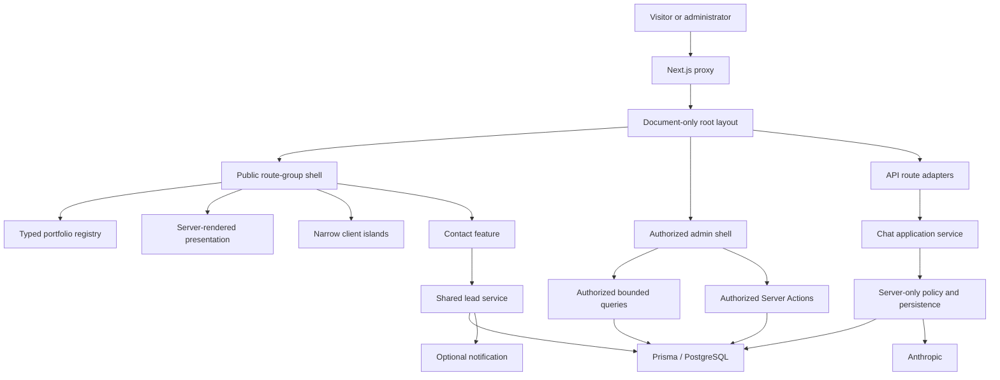

# Inside Dopamine — Current Technical and Architecture Audit

**Baseline audit:** 2026-07-20

**Phase One verification and consolidation:** 2026-07-22

**Phase Two architecture synchronization:** 2026-07-23

**Production dependency modernization:** 2026-07-24

**Phase One:** COMPLETE

**Phase Two:** COMPLETE

**Release status:** Engineering Complete — Production Launch Pending

**Production readiness:** BLOCKED by [CLEAN.md](CLEAN.md)

## 1. Scope and evidence boundary

This is the current consolidated evidence record. It preserves the still-relevant Phase One security/correctness history and synchronizes it with the completed Phase Two architecture. It is not a new security audit, production-readiness audit, legal approval, deployment report, or claim that production-only behavior was tested.

The reviewed Phase Two surface includes App Router layouts/routes, typed data registries, presentation boundaries, design-system tokens/primitives, admin query/action modules, contact/chat features, Prisma schema/migration changes, server-only dependency boundaries, focused tests, and production build output.

No environment value, credential, connection string, personal record, provider response, full transcript, production data, or protected admin record is recorded here. Phase Two did not perform a production/shared migration, seed, webhook delivery, external provider call, deployment, commit, or push.

The historical 4.7/10 security score and 33-finding baseline remain retired. The Phase 2.0 architecture review now scores the current repository **8.5/10 for architecture**. That is a structure/ownership assessment, not a security or production-readiness score.

## 2. Current architecture

Inside Dopamine is a Next.js 16.2.11 App Router application using React 19.2.8, strict TypeScript, Tailwind CSS 4, Prisma 7.9.0 with the PostgreSQL driver adapter, Anthropic, Upstash-compatible Redis, and an optional notification webhook.

Current ownership:

- `src/app/layout.tsx` owns the document, font, global stylesheet, and root metadata only.
- `src/app/(public)/layout.tsx` owns public navigation, transition, main, scroll control, footer, and chat.
- `src/app/admin/layout.tsx` owns authorization, admin chrome, admin content width, and the admin main.
- `src/app/(public)/work/[slug]/page.tsx` is the only case-study detail route owner.
- `src/data/portfolio.ts` owns Product Engineering, Business Intelligence, and Growth identities and projections.
- `src/features/contact` owns contact composition, client contract/form, and server action.
- `src/features/chat/server` owns chat orchestration, policy, typed outcomes, and conversation persistence.
- Route-colocated admin query/action modules own authorized admin reads and mutations.
- `src/lib/server/public-api-core.ts` is transport-neutral; `src/lib/public-api.ts` owns Next.js response construction.
- `src/styles/globals.css` is the authoritative Tailwind v4 CSS-first design-system source.
- `src/lib/lead-service.ts`, `src/lib/prisma.ts`, `src/lib/ai.ts`, `src/lib/rate-limit.ts`, environment/authentication modules, feature server modules, and route helpers are explicitly server-only.

## 3. Current security and correctness condition

| Area | Current verified condition | Remaining boundary |
| --- | --- | --- |
| Framework and ORM | Next.js/eslint-config-next remain 16.2.11; React/React DOM are 19.2.8; Prisma CLI, Client, and PostgreSQL adapter are 7.9.0. Prisma generation/configuration and the Webpack production build pass. | The latest stable graph still reports six High production audit advisories, and the default Turbopack build remains blocked by the documented offline Google-font fixture before application compilation. DEP-01 remains open. |
| Admin | Proxy Basic challenge plus timing-safe, fail-closed authorization on protected reads and exported actions. Initial reads are server-first and collection reads are bounded. | Shared identity still lacks per-user attribution, selective revocation, MFA, RBAC, and durable auth-attempt throttling. HTTPS/HSTS must be verified before launch. |
| Public endpoints | Strict methods/content types, actual byte ceilings, bounded schemas/identifiers, quotas, deadlines, zero provider retries, safe typed errors, request IDs, and `no-store`. | Distributed Redis and deployed proxy trust remain unverified. |
| Lead truth | Contact/chat share one database-first idempotent service. Notification outcome is separate and duplicate-safe. | Scheduled notification retry/outbox remains open. |
| Chat | Canonical history and provider messages are server-owned; one application service orchestrates rate limit, database, FAQ grounding, provider, policy, persistence, and lead-capture decisions. | Cross-instance paid-call reservation and broader grounded-output evaluation remain open. |
| Conversation data | Transcript writes use optimistic versioning and maintain a durable constrained `messageCount`. Lists do not select transcript JSON. | The Phase 2.3C migration has not been applied to a production/shared database. |
| Module graph | Static checks prevent client reachability of server implementations, reverse feature/shared imports from `src/app`, and server exports through client-facing barrels. | Checks cover repository-local static imports; deployment artifact inspection remains part of release verification. |
| Seed | FAQ replacement requires the exact acknowledgement in every environment and runs in one transaction. | The seed was not run during Phase Two. |
| Accessibility | Audited contrast remains intact; new primitives expose explicit focus/error/disabled states; CSS presentation motion honors reduced motion. | Broader overlay/chat focus, announcements, skip/current/heading behavior remains future work. |

No raw SQL application sink, unsafe HTML injection sink, `eval`, open redirect, or application client-side secret reference was identified in the inherited Phase One review. Prisma application writes use explicit fields and parameterized APIs. The Phase 2.3C migration intentionally uses reviewed SQL for backfill, constraint, and index creation.

## 4. Resolved architecture findings

| ID | Completed improvement | Current evidence |
| --- | --- | --- |
| H-01 | Public/admin shell split | Root is document-only; public/admin layouts own separate chrome and one main each. |
| H-02 | Typed Product/BI/Growth taxonomy | One client-safe registry projects categories, services, routes, cards, case-study relations, navigation, and contact options. |
| H-03 | Case-study route ownership | One `[slug]` route owns all known detail URLs, static params, metadata, canonical/Open Graph data, related work, 404 behavior, and sitemap entries. |
| H-04 | Static presentation hydration reduction | Nine prioritized presentation components are Server Components; reveal intent is CSS-based and reduced-motion safe. |
| M-01 | Chat application-service extraction | HTTP handling remains in the route; server orchestration/persistence/policy moved to `src/features/chat/server`. |
| M-02 | Bounded admin reads and transcript-free conversation lists | Stable cursor pages use default 25 / maximum 50 and narrow DTOs; list queries select `messageCount`, not `messages`. |
| M-03 | Server-first FAQ/conversation loading | Both pages render initial data on the server; FAQ editor receives initial DTOs and updates local state from mutation results. |
| M-04 | Contact feature ownership | Contact composition, client contract/form, and action are feature-owned; shared UI does not import from routes. |
| M-06 | Server-module dependency boundaries | Explicit protection, transport/core split, client-safe contracts, narrowed barrels, and static dependency checks are implemented. |
| L-03 | Competing Tailwind configuration | The unused `tailwind.config.ts` was removed after production-build verification. |

The Phase 2.4A.1 route-contract repair also resolved unsupported route exports and the admin conversation page prop mismatch by moving reusable route parsers into adjacent server-only helpers.

## 5. Partially resolved findings

| ID | Current residual risk | Completed portion | Remaining work |
| --- | --- | --- | --- |
| H-05 | **Medium** | Semantic tokens, named widths, normalized primitives, CSS-first Tailwind authority, focus/state rules, and representative public/admin migrations are complete. | Deprecated aliases and manual route-level values remain on unmigrated surfaces. Retire them incrementally during the redesign after visual tests. |
| L-02 | **Low** | Static presentation no longer hydrates for reveal effects; CSS reduced-motion rules are tested. | Legacy/unused motion modules and some intentional client components still import Framer Motion directly instead of following one final façade policy. Decide and normalize while removing dead presentation files. |

These partial items do not block the visual redesign. They constrain how redesigned surfaces should be migrated.

## 6. Still-open findings

| ID | Current risk | Open condition | Required next decision |
| --- | --- | --- | --- |
| M-05 | **Medium** | Personalisation/recommendation is split across proxy tagging, dynamic service ordering, APIs, data persistence, and an unreferenced client hero. | Assign a measured Product/Growth owner and tests, or remove the orphaned path. Do not broaden caching changes until that decision is made. |
| L-01 | **Low** | Eight presentation experiments remain unreferenced or reachable only through unused modules: `Header`, `AboutClient`, `DopamineSystemCore`, `DopamineLoop`, `FeaturedWork`, `CTA`, `DynamicHero`, and `WorkHeroBackdrop`. | Remove them only after a final importer/build check; coordinate the personalisation-related file with M-05. |

No Critical or High architecture risk remains from the Phase 2.0 review. The active architecture residual is two Medium and two Low items when the partial findings are included.

## 7. Completed Phase One implementation

Phase One remains historically complete; Phase Two did not replace or weaken its contracts.

| Control | Disposition |
| --- | --- |
| SEC-001 framework advisories | Resolved for the audited Next.js advisories. |
| SEC-002 point-of-use authorization | Resolved. Protected reads and exported admin actions are covered. |
| SEC-003 public endpoint protection | Engineering complete; production topology remains RATE-IDENTITY-01. |
| LOGIC-001 truthful chat/contact lead behavior | Resolved in code, mocks, and isolated durable success. |
| DATA-003 destructive seed safety | Resolved through exact acknowledgement and atomic replacement. |
| A11Y-001 launch-blocking semantic contrast | Resolved for the audited pairs/states. |
| TEST-001 regression foundation | Resolved for Phase One with 148 tests across 12 files and CI definition. |
| OPS-002 environment contract | Resolved through protected server validation and value-free `.env.example`. |
| MAINT-001 lint baseline | Resolved; full ESLint passed with no warnings/errors. |
| Chat request construction and failure contract | Resolved; verified through mocks plus one bounded real provider success. |
| Phase One database migration | Verified in an isolated temporary schema; not applied to a persistent application schema during closure. |

The original chatbot defect was deterministic: a decorative assistant greeting entered client-supplied history and could produce assistant-first provider context, while broad error handling collapsed unrelated failures. The repair made history server-authoritative, guaranteed a user-first provider sequence, bounded work, mapped safe typed failures, and made browser behavior respect HTTP outcomes. Phase Two preserved that behavior while moving the orchestration behind a dedicated application service.

## 8. Phase One isolated evidence preserved

The configured pooled/direct PostgreSQL values were checked without displaying them. They had the expected pooled/direct roles, TLS, same isolated endpoint/database identity, a non-superuser role, and branch metadata.

The Phase One rehearsal used uniquely named temporary schemas and exact repository migration order:

- representative pre-migration data: 2 Leads, 2 Conversations, 2 SegmentEvents, and 1 Faq;
- a forced failure rolled back transactionally with counts intact;
- roll-forward applied successfully;
- all representative records were retained;
- enum/default changes, five unique indexes, notification lookup index, relations, referential actions, uniqueness/idempotency, and invalid-relation rejection passed;
- one real contact Server Action persisted one synthetic Contact Lead and one `NOT_CONFIGURED` notification before returning success;
- required trace/idempotency/fingerprint state was present, no meeting was claimed, and no webhook fired.

All temporary rehearsal schemas were removed. Existing schemas/data were not targeted.

After those prerequisites passed, exactly one synthetic, non-personal chat request reached Anthropic with automatic SDK retries disabled. It returned bounded HTTP 200 JSON with `no-store` and a safe request ID in under five seconds; provider history began with a user turn; one exchange persisted; and no fabricated operational claim or sensitive provider content was printed. This was a one-time isolation check, not a production, load, availability, or cost guarantee.

Phase Two made no external provider or notification call.

## 9. Phase Two validation evidence

| Check | Current result | Evidence boundary |
| --- | --- | --- |
| TypeScript | Passed | Strict project `npm run typecheck`. |
| ESLint | Passed | Full project gate. |
| Automated tests | Passed | Current suite: 21 files / 221 tests. Phase Two closed at 20 files / 214 tests; Phase One’s historical baseline was 12 files / 148 tests. |
| Production build | Partially passed | Next.js 16.2.11 Webpack production build and postbuild secret scan passed; the default Turbopack path reproduced only the pre-existing offline Google-font fixture resolution failure before application compilation. |
| Prisma validation/generation | Passed | Prisma 7.9.0 config and schema resolve against synthetic unreachable URLs; the generated client and seed help resolve without migration or seed execution. |
| Route ownership | Passed | Public/admin shell, case-study URLs/static params/metadata/404/sitemap, and Next.js route-export contracts have focused tests. |
| Design system | Passed | Token integrity, variants, compatibility tracking, contrast-sensitive states, and public/admin reference surfaces are covered. |
| Server presentation | Passed | Nine migrated components are statically checked for accidental client/motion imports; representative output/native disclosure/reduced motion are covered. |
| Admin loading/pagination | Passed | Authorization, initial server reads, bounded sizes, stable cursors, narrow selections, count accuracy, invalid cursors, and detail transcript access are covered. |
| Contact/chat | Passed | Contact state/idempotency/contracts and chat HTTP/orchestration/provider/persistence/concurrency/lead decisions are covered without external services. |
| Dependency boundaries | Passed | TypeScript-AST tests reject reverse imports, client reachability of protected modules, unsafe barrels, missing protection, and framework coupling in transport-neutral core. |
| Client-bundle leakage inspection | Passed for inspected build | No Prisma, database implementation, provider integration, authentication internals, notification implementation, or private configuration identifier was found in inspected browser chunks. |

The Phase Two migration `20260722160000_add_conversation_message_count` was reviewed and statically characterized. It adds/backfills `messageCount`, constrains it to JSON-array length, and adds the `(createdAt DESC, id DESC)` index. It was not applied to a production or shared database.

## 10. Current technical debt and risk levels

### Architecture debt

| Priority | Risk | Debt |
| --- | --- | --- |
| 1 | Medium | Resolve M-05 personalisation/recommendation ownership before relying on the dynamic service-ordering path. |
| 2 | Medium | Expand design-system adoption during the visual redesign and retire aliases only after affected surfaces pass visual/accessibility checks. |
| 3 | Low | Remove the eight verified dead presentation experiments. |
| 4 | Low | Establish one final Framer Motion import/facade policy for the intentional client islands and delete obsolete motion code. |
| 5 | Low to Medium | Consolidate repeated service-detail composition after characterization; URLs/content must remain registry-backed. |

### Security, operations, and launch debt

| Priority | Risk | Debt |
| --- | --- | --- |
| 1 | **Launch blocker** | DEP-01 dependency disposition. |
| 2 | **Launch blocker** | PRIV-001 policy approval and enforceable data lifecycle. |
| 3 | **Launch blocker** | RATE-IDENTITY-01 distributed Redis and trusted proxy verification. |
| 4 | High before production | Individual admin identity, secure sessions, MFA/RBAC, attribution, and auth throttling. |
| 5 | Medium | Notification outbox/retry, cross-instance paid-call reservation, grounded-output evaluation, and operational health/metrics/alerts. |
| 6 | Medium | Broader accessibility, performance, SEO/social metadata, sitemap-date, CSP/HSTS, backup/rollback, and live release evidence. |

The three launch blockers are governed by [CLEAN.md](CLEAN.md). Phase Two completion does not lower their release impact.

## 11. Dependency disposition

The 2026-07-24 clean-install audit of the exact latest stable target graph reports six High production entries and 12 full-graph entries (10 High, 1 Moderate, 1 Low), with 0 Critical. Production entries are in latest-stable Prisma CLI tooling (`@prisma/dev` → `find-my-way`) and Next.js-bundled PostCSS/sharp. npm offers only `--force` downgrade/breaking remedies; none were applied.

The direct Anthropic SDK advisory remains resolved at 0.91.1. Unrelated major upgrades (Anthropic SDK, ESLint, TypeScript, and Node type packages) and behavior-sensitive Tailwind, Framer Motion, and Upstash updates were deliberately deferred. DEP-01 therefore remains a launch blocker pending upstream stable fixes or explicit time-bounded risk disposition.

## 12. Verified behavior versus pending production verification

| Verified locally/in isolation | Pending production verification or approval |
| --- | --- |
| Separate public/admin shells and one main per surface | Actual hosted navigation/shell smoke checks on the release revision |
| Admin point-of-use authorization, bounded server reads, and fail-closed behavior | HTTPS/HSTS and operational credential rotation; individual identity remains future work |
| Public schemas, limits, local quotas, safe errors, deadlines, and redaction | Distributed Redis, shared-instance behavior, and proxy-overwritten identity |
| Reviewed migrations, including message-count SQL and static tests | Authorized persistent migration, backup/roll-forward, and application rollback |
| Durable contact without webhook | Notification provider delivery/monitoring if enabled |
| Exactly one historical configured Anthropic success | Production hosting/network/provider behavior, load, cost, availability, and cross-instance reservation |
| Factual privacy/terms/capture notices render | Legal/business approval and enforceable lifecycle operations |
| Local quality gates and inspected build chunks | CI from the exact production release revision and redacted post-deploy smoke checks |

## 13. Conclusion

**Phase One engineering is COMPLETE. Phase Two architecture refinement is COMPLETE. The repository is READY for UI/UX redesign. Production readiness remains BLOCKED.**

The current architecture has separate shells, canonical route/data ownership, a CSS-first design foundation, server-first presentation/admin rendering, bounded collection reads, durable conversation summaries, feature-owned contact/chat workflows, and explicit server/client dependency protection. The remaining architecture work is limited to personalisation ownership, dead/legacy presentation cleanup, and gradual design-system/motion consolidation.

Production launch remains exclusively subject to the unresolved gates and release checklist in [CLEAN.md](CLEAN.md).
