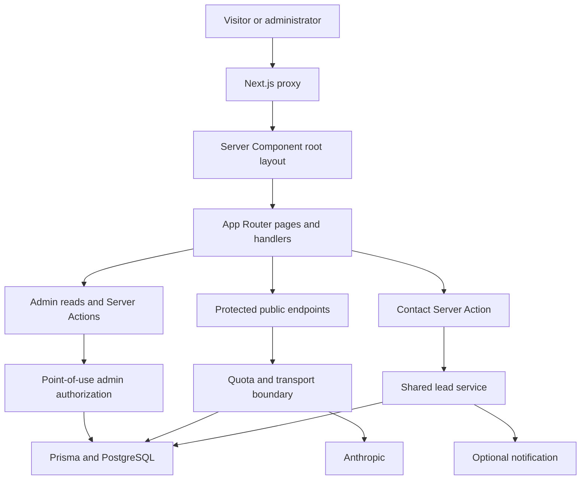

# Inside Dopamine — Current Technical and Security Audit

**Baseline audit:** 2026-07-20

**Phase One verification and consolidation:** 2026-07-22

**Engineering status:** Phase One COMPLETE

**Release status:** Engineering Complete — Production Launch Pending

**Production readiness:** BLOCKED by [CLEAN.md](CLEAN.md)

## 1. Scope and evidence boundary

This is the consolidated current-state record. It preserves the still-relevant findings, decisions, and validation evidence from the original audit and Phase One reports without repeating the obsolete pre-remediation narrative. It is not a new technical audit or a claim that production-only behavior was tested.

The reviewed surface included App Router routes/layouts, components, Server Actions, API handlers, data/domain modules, Prisma schema/migrations/seed policy, proxy and admin authorization, external integrations, styling, tests, CI, environment handling, public assets, generated client assets, and documentation.

No environment value, credential, connection string, personal record, provider response, full transcript, production data, or protected admin record is recorded here. No production migration, seed, webhook delivery, deployment, commit, or push formed part of the evidence.

The historical 4.7/10 score and 33-finding baseline are retired rather than recalculated. The authoritative status is now the control/evidence disposition below.

## 2. Current architecture

Inside Dopamine is a Next.js 16 App Router application using React 19, strict TypeScript, Tailwind CSS 4, Prisma/PostgreSQL, Anthropic, Upstash-compatible Redis, and an optional notification webhook.

Key ownership:

- The root layout is a Server Component and owns one semantic `<main>` with a narrow pathname-based client transition.
- The proxy challenges `/admin` and derives visitor metadata; sensitive admin reads/actions independently authorize at their point of use.
- `src/lib/env.ts` owns validated server configuration.
- `src/lib/public-api.ts` and `src/lib/rate-limit.ts` own safe public transport, errors, identities, and quotas.
- `src/lib/lead-service.ts` owns contact/chat normalization, idempotency, persistence, relations, and notification outcomes.
- `src/lib/ai.ts` owns the bounded provider client.
- Prisma owns Lead, LeadNotification, Conversation, Faq, and SegmentEvent persistence.

Known Phase Two architecture work—not a reason to reopen Phase One—includes separating public/admin shells, consolidating duplicate case-study route ownership and service templates, removing verified dead UI, bounding wider admin reads, reducing static client hydration, and adding broader operational tooling.

## 3. Current security and correctness condition

| Area | Current verified condition | Boundary |
| --- | --- | --- |
| Framework | Next.js and matching lint configuration are patched to 16.2.11; the original proxy-bypass advisories are absent. | New transitive advisories are handled by DEP-01. |
| Admin | Proxy Basic challenge plus server-only, timing-safe, fail-closed authorization on protected reads and all eight exported actions. Unauthorized paths reject before Prisma access. | Shared identity lacks per-user attribution, selective revocation, MFA, RBAC, and durable auth-attempt throttling; replacement is Phase Two. HTTPS/HSTS must be verified before launch. |
| Public endpoints | Strict methods/content types, known fields, actual UTF-8 byte ceilings, bounded schemas/identifiers, quotas, deadlines, zero provider retries, safe typed errors, request IDs, and `no-store`. | Distributed Redis and the deployed proxy trust chain remain unverified. |
| Lead truth | Contact and chat use one database-first idempotent service. Notification outcome is separate and duplicate-safe. Browser success follows durable persistence. | Scheduled notification retry/outbox remains Phase Two. |
| Chat | Canonical history is server-owned; writes use optimistic versioning and stored-message idempotency; operational claims are deterministically removed. | Cross-instance paid-call reservation and broader grounded-output controls remain Phase Two. |
| Seed | FAQ replacement requires the exact acknowledgement in every environment and runs in one transaction. | The seed was not run during closure. |
| Secrets | Server integrations remain behind server-only boundaries. The repository/history/client-asset scan found no credible credential. | Signature scanning is bounded; private server artifacts/source maps must not be published. |
| Accessibility | Audited semantic contrast and disabled-control colors meet their intended AA thresholds. | Overlay/chat focus, announcements, reduced motion, skip/current/heading details remain Phase Two. |

No raw SQL, unsafe HTML injection sink, `eval`, open redirect, or application client-side secret reference was identified. Prisma writes use explicit fields and parameterized APIs.

## 4. Confirmed Phase One implementation

| Control | Disposition |
| --- | --- |
| SEC-001 framework advisories | Resolved for the audited Next.js advisories. |
| SEC-002 point-of-use authorization | Resolved. Protected reads and all eight exported admin actions are covered. |
| SEC-003 public endpoint protection | Engineering complete; production topology remains RATE-IDENTITY-01. |
| LOGIC-001 truthful chat/contact lead behavior | Resolved in code, mocks, and isolated durable success. |
| DATA-003 destructive seed safety | Resolved through exact acknowledgement and atomic replacement. |
| A11Y-001 launch-blocking semantic contrast | Resolved for the audited pairs/states. |
| TEST-001 regression foundation | Resolved for Phase One scope with Vitest, 148 tests, and CI definition. |
| OPS-002 environment contract | Resolved through one server-only validator and value-free `.env.example`. |
| MAINT-001 lint baseline | Resolved; full ESLint passes with no warnings/errors. |
| Chat request construction and failure contract | Resolved; verified through mocks plus one bounded real provider success. |
| Phase One database migration | Verified in an isolated temporary schema; not applied to a persistent application schema. |

The original chatbot had a deterministic request-construction defect: a decorative assistant greeting entered client-supplied history, producing assistant-first provider context, while a broad error handler collapsed unrelated failures into one generic response. The exact failing layer in the historical deployed observation was never captured, so that uncertainty is preserved.

The repair removes client authorship of provider history, begins canonical provider input with a user turn, validates dependencies before use, bounds provider work, maps typed failures to stable safe responses, and makes the widget respect HTTP failure/success. The configured integration subsequently succeeded once end to end.

## 5. Isolated database and durable contact evidence

The configured pooled and direct PostgreSQL values were checked without displaying them. They had the expected pooled/direct roles, TLS, same Neon endpoint/database identity, a non-superuser role, and Neon branch metadata. The development designation came from the explicitly user-designated isolated branch; no branch name or identifier was recorded.

The authoritative rehearsal used a uniquely named temporary schema and the exact repository migration order:

- representative pre-migration data: 2 Leads, 2 Conversations, 2 SegmentEvents, and 1 Faq;
- a forced Phase One failure rolled back transactionally with counts intact;
- roll-forward applied successfully;
- all representative records were retained;
- enum/default changes, five unique indexes, the notification lookup index, relations, set-null/cascade actions, uniqueness/idempotency behavior, and invalid-relation rejection passed;
- one real contact Server Action then persisted one synthetic Contact Lead and one `NOT_CONFIGURED` notification before returning success;
- required trace/idempotency/fingerprint state was present, no meeting was claimed, no webhook fired, and no existing public-schema row was created.

All temporary rehearsal schemas, including preliminary harness attempts, were removed. Existing schemas/data were not targeted and the persistent application schema remained pre-Phase-One.

## 6. Exactly one real Anthropic verification

After the isolated migration and durable-contact prerequisites passed, exactly one synthetic, non-personal `/api/chat` request reached Anthropic. Automatic SDK retries were disabled, and no second request was made.

Verified result:

- valid bounded HTTP 200 JSON response with `no-store` and a safe request ID;
- completion in under five seconds;
- canonical provider history began with the user turn and excluded the decorative greeting;
- one user/assistant pair persisted and the stored assistant response matched the returned response;
- no fabricated booking, callback, receipt, or response-deadline claim;
- no provider content, transcript, credential, model detail, or sensitive payload was printed.

This verifies the configured local/isolation path once. It is not a load test, availability guarantee, production deployment test, or permission for another paid request.

## 7. Verification evidence

| Check | Result | Evidence boundary |
| --- | --- | --- |
| Clean install | Passed in the Phase One closure | `npm ci` completed and `postinstall` generated Prisma Client. |
| TypeScript | Passed | Strict project `npm run typecheck`; explicit side-effect import checking is enabled. |
| ESLint | Passed | Full project, zero errors and zero warnings. |
| Automated tests | Passed | Full Phase One suite: 12 files / 148 tests. After the database/provider checks, 3 affected files / 48 tests passed. After documentation consolidation, 7 focused contract files / 87 tests passed without repeating the complete suite. |
| Production build | Passed | Next.js 16.2.11 generated 23 static pages using a non-secret HTTPS canonical-origin override; no environment file changed. |
| Prisma validation | Passed | Actual ignored local datasource configuration was supplied through a value-free wrapper because Prisma CLI does not load `.env.local` automatically. |
| Migration | Passed in isolation | Exact repository order, retained data, rollback, roll-forward, constraints, indexes, relations, and behavior passed; temporary schema removed. |
| Durable contact | Passed in isolation | Real Server Action persisted the synthetic Lead and notification outcome before browser success; no webhook. |
| Real Anthropic | Passed exactly once | One bounded request, zero retries, contract/history/persistence/claim checks passed. |
| Mocked chat matrix | Passed | Configuration, auth/model/quota, timeout/network, malformed output, persistence, duplicates/conflicts, concurrency exhaustion, validation/size/media, fabricated history, redaction, and browser recovery branches are covered without provider calls. |
| Local limiter | Passed | Session and primary-identity limits, identifier rotation resistance, safe `429`/`Retry-After`, and production fail-closed configuration behavior passed locally/mocked. |
| Browser regression | Passed for exercised paths | Representative desktop/mobile layout, one main, navigation/Back/Forward transition, mobile pointer path, controlled failures, durable contact success, admin denial, public transport limits, and clean-console checks passed. |
| Secret review | Passed within scope | Source, reachable Git history, ignored environment handling, docs/tests/assets, generated client bundle, response/log surfaces, source-map boundary, and imports yielded no credible credential. |
| Dependency audit | Production launch blocked | 6 production entries (5 High, 1 Moderate) and 12 full-graph entries (9 High, 2 Moderate, 1 Low), 0 Critical. |
| Diff integrity | Passed at closure | `git diff --check` returned no whitespace errors. |
| Documentation consolidation | Passed | Exactly five root Markdown files remain; removed-path and broken-link searches passed; every `npm run` command in README maps to `package.json`; typecheck, full lint, 87 focused tests, and final whitespace checks passed. |

The repository secret scan covers tracked/untracked non-ignored source, reachable historical blobs, and generated browser assets without printing candidates. Client assets contained no recognized server-only environment name, credential signature, or source map. Application logs are limited to request IDs, stable codes, categories, statuses, durations, retryability, and redacted seed error type.

## 8. Dependency disposition

The direct Anthropic SDK advisory was resolved by the narrow 0.90.0 → 0.91.1 patch. Remaining categories are:

| Category | Installed path/surface | Current disposition |
| --- | --- | --- |
| Effect | Prisma CLI/config transitive dependency | Open; application runtime does not import the reported RPC/context path, but the affected package remains installed. Requires an upstream-compatible Prisma change or formal acceptance. |
| PostCSS | Next.js nested production build dependency | Open; no visitor-controlled CSS input exists, but the affected component remains installed. Do not apply the audit-suggested unsafe Next downgrade. |
| sharp | Optional Next.js image dependency | Open; no image upload or visitor-controlled image source exists, but the affected component remains installed. Await/verify aligned upstream resolution. |
| Babel, ajv, brace-expansion, flatted, js-yaml, minimatch | Development/build/lint tooling | Open tooling risks; ordinary inputs are repository-controlled. Resolve through compatible owning-tool upgrades or formal disposition. |

No open item has an accepted named owner with an expiry/review date. [DEP-01](CLEAN.md#dep-01--dependency-disposition) therefore remains a production-launch gate.

## 9. Verified behavior versus pending production verification

| Verified locally/in isolation | Pending production verification or approval |
| --- | --- |
| Admin point-of-use authorization and fail-closed behavior | HTTPS/HSTS at the actual termination layer and operational credential rotation |
| Public schemas, limits, local quotas, safe errors, deadlines, and redaction | Distributed Redis availability, shared-instance behavior, and proxy-overwritten trusted identity |
| Exact migration on synthetic temporary-schema data | Authorized persistent migration, production backup/roll-forward, and application rollback |
| Durable contact without webhook | Actual notification provider delivery/monitoring if enabled |
| Exactly one real configured Anthropic success | Production hosting/network/provider behavior, load, cost, and availability |
| Factual privacy/terms/capture notices render | Legal/business approval, final controller/processors/transfers/retention, and enforceable lifecycle operations |
| Local/CI-defined quality gates | CI execution from the exact production release revision and redacted post-deploy smoke checks |

## 10. Conclusion

**Phase One engineering is COMPLETE. Production readiness remains BLOCKED.**

The engineering foundation has verified authorization, public request protection, truthful durable lead behavior, server-authoritative chat, isolated migration safety, one configured provider success, regression coverage, static quality, build, Prisma, secret, and browser evidence. The remaining production launch gates are exclusively maintained in [CLEAN.md](CLEAN.md).

Phase Two may begin without waiting for those business/release gates, but no revision may be represented as production-ready or deployed until all launch gates close and the approved release checklist is executed.
