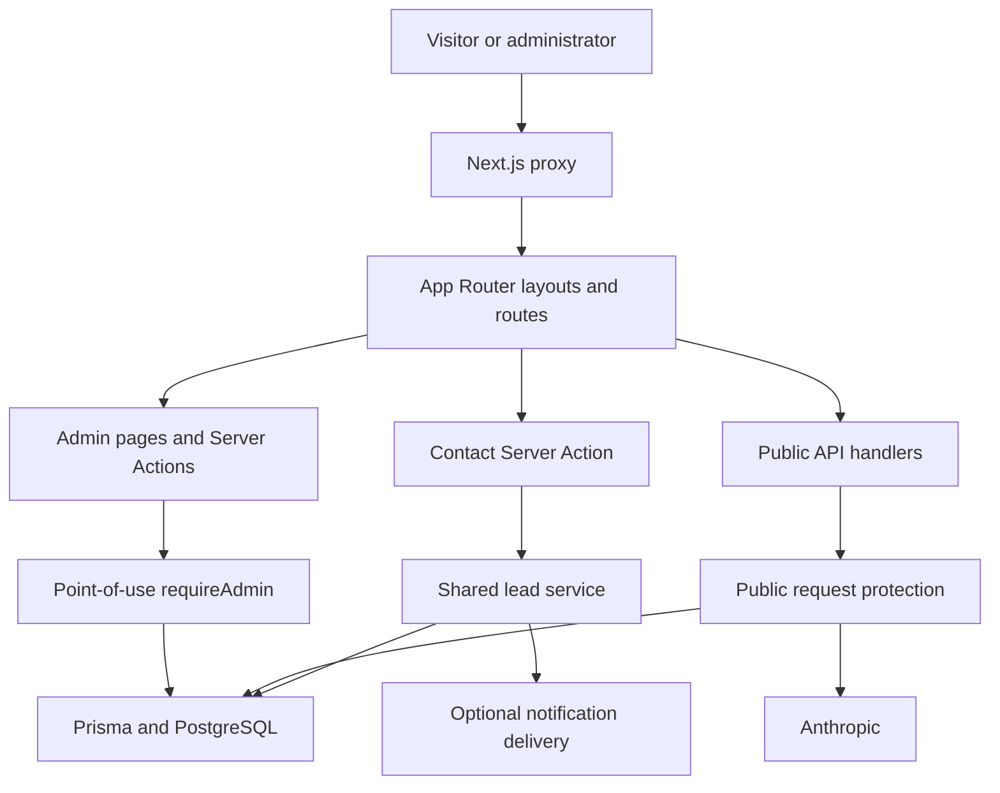

# Inside Dopamine — Product and Engineering Requirements

**Document status:** Active canonical PRD

**Engineering status:** Phase One COMPLETE

**Release status:** Engineering Complete — Production Launch Pending

**Production readiness:** BLOCKED by [CLEAN.md](CLEAN.md)

**Phase Two:** May begin independently

## 1. Product purpose

Inside Dopamine is the flagship proof that the team can build dependable digital products, transform product data into business intelligence, and create growth systems that bring those products customers.

The platform should present three connected capabilities:

| Capability | Evidence presented |
| --- | --- |
| Product and application development | Web applications, booking/operations systems, automation, AI products, and technical case studies |
| Business intelligence | Dashboards, reporting systems, analytical models, and decision-support work |
| Growth and acquisition | Google Ads strategy, campaign execution, optimization, and attributable commercial outcomes |

The positioning is:

> We build the product, transform its data into business intelligence, and create the growth system that brings customers to it.

The application is being improved incrementally. A framework rewrite is not justified; the Server Component foundation, strict TypeScript setup, design language, Prisma access pattern, centralized content, and route transition should be preserved unless evidence supports a targeted change.

## 2. Users and journeys

### Prospective client

1. Understand the team’s capabilities and approach.
2. Browse services and case studies.
3. Ask the assistant a question without giving the browser control of canonical conversation history.
4. Request follow-up through chat or submit the contact form.
5. Receive success only after one durable lead outcome exists; otherwise retain entered information and receive a truthful recovery path.

### Administrator

1. Authenticate through the interim protected admin boundary.
2. View and manage leads, FAQs, and conversations.
3. Perform every sensitive read or mutation through point-of-use server authorization.
4. See durable lead-notification outcomes without exposing full records unnecessarily.

### Engineering and business owners

1. Extend portfolio content without duplicating route or domain logic.
2. Run local and CI checks without production services or personal data.
3. Release only after explicit dependency, privacy/lifecycle, and hosting-trust gates close.

## 3. Product and engineering requirements

### Public experience

- Preserve a coherent responsive portfolio with one semantic main landmark and stable navigation/chrome.
- Keep service and case-study content factual, maintainable, and extensible to Product, BI, and Growth categories.
- Present validation, dependency failure, quota rejection, and success as distinct states.
- Do not claim a booking, callback, receipt, or response deadline unless the corresponding operational commitment exists.
- Preserve form values after failure and clear them only after durable success.

### Chat and lead integrity

- The server owns canonical user/assistant history; decorative client greetings are never provider history.
- Input, identifiers, history, and request bytes are strictly bounded.
- Provider calls use explicit deadlines, zero automatic retries, and bounded in-process concurrency.
- Chat and contact use one lead service with source, trace ID, idempotency key, optional conversation relation, and durable notification state.
- Lead persistence precedes optional notification. Duplicate requests return the existing durable result rather than creating a second lead or notification.
- Transcript updates use optimistic concurrency and stored-message idempotency.

### Administration and security

- The proxy is an outer Basic Auth challenge, not the sole authorization control.
- Every sensitive admin read and exported Server Action authorizes before validation, logging, cache revalidation, or Prisma access.
- Missing/unsafe admin configuration fails closed; unauthorized behavior does not disclose record existence.
- Administration must run behind verified HTTPS/HSTS. Individual identities, expiry, revocation, MFA, RBAC, and attribution remain the target design.
- Public write/AI endpoints require strict schemas, actual UTF-8 byte limits, primary client and secondary session quotas where applicable, safe typed errors, request IDs, and `no-store` responses.

### Data, configuration, and operations

- PostgreSQL through Prisma is the source of truth for leads, conversations, FAQs, segment events, and notification state.
- Runtime configuration is validated by one server-only feature-boundary module; no secret-bearing module may enter the client bundle.
- `DATABASE_URL` and `DIRECT_URL` must identify the same explicitly isolated target before migration work.
- FAQ replacement requires the exact acknowledgement in every environment and runs atomically.
- Logs and customer responses contain stable codes, categories, statuses, timings, and request IDs—not credentials, provider bodies, transcripts, lead PII, or raw database errors.
- Production uses a distributed limiter and a proxy-overwritten trusted client address. Local in-memory results do not prove production topology.

## 4. Phase One scope and completion

Phase One established the engineering safety foundation without production access, a production deployment, or a public redesign.

| Completion criterion | Status and evidence |
| --- | --- |
| Patched framework/provider baseline | Complete. Next.js and matching lint configuration are 16.2.11; Anthropic SDK is 0.91.1. |
| Point-of-use admin authorization | Complete. Protected reads and all eight exported actions authorize before sensitive work. |
| Public endpoint protection | Complete in code/local tests. Schemas, byte limits, quotas, deadlines, zero provider retries, stable errors, and redacted diagnostics are implemented. |
| Truthful durable lead behavior | Complete. Contact and chat share one idempotent database-first lead contract; notification state is separate. |
| Server-authoritative chatbot | Complete. Canonical history, optimistic persistence, safe output replacement, failure contracts, and browser recovery are covered. |
| Environment and seed safety | Complete. A value-free environment contract and atomic, acknowledgement-gated FAQ replacement exist. |
| Database change safety | Complete for engineering closure. Exact repository-order migrations, representative retained rows, rollback, roll-forward, indexes, constraints, relations, and uniqueness/idempotency passed in a removed temporary schema. |
| Configured integration proof | Complete for engineering closure. One durable contact and exactly one bounded real Anthropic request passed in the isolated environment. |
| Quality foundation | Complete. CI definition, 148 automated tests, clean typecheck/lint/build/Prisma validation, secret scan, and representative browser regression evidence exist. |
| Launch-blocking semantic contrast | Complete for the audited tokens and disabled controls. Wider interaction accessibility is Phase Two. |

**Formal Phase One status: Engineering Complete — Production Launch Pending.**

The remaining dependency, privacy/data-lifecycle, and production Redis/trusted-proxy requirements are production-launch gates in [CLEAN.md](CLEAN.md). They do not reopen Phase One engineering or prevent Phase Two from beginning, but production deployment must wait for them.

## 5. Architecture summary

Current ownership:

- `src/app` owns App Router pages, layouts, route handlers, Server Actions, metadata routes, and the global CSS entry.
- `src/components` owns layout, section, and UI components.
- `src/data/caseStudies.ts` owns typed case-study content.
- `src/lib/env.ts` owns the server configuration contract.
- `src/lib/admin-auth*` owns interim credential verification and point-of-use authorization.
- `src/lib/public-api.ts` and `src/lib/rate-limit.ts` own public transport/error/quota behavior.
- `src/lib/lead-service.ts` owns contact/chat lead validation, idempotent persistence, relations, and notification outcomes.
- `src/lib/ai.ts` owns the bounded Anthropic client configuration.
- `prisma` owns the PostgreSQL schema, migrations, and guarded FAQ replacement.

The root layout remains a Server Component with a narrow client route-transition boundary. Public and admin shells are still coupled, case-study URLs have duplicate explicit/dynamic owners, and several static presentation surfaces remain client-heavy; those are Phase Two cleanup concerns rather than Phase One closure defects.

## 6. Architecture Decisions

These five accepted decisions replace the former standalone ADR files.

### AD-001 — Interim and target administrator authentication

Phase One retains shared HTTP Basic Auth as an interim compatibility boundary. Credentials are server-only, validated at request time, compared through fixed-length timing-safe digests, and fail closed. The proxy provides the outer challenge; it never supplies implicit authorization to sensitive work.

Admin must be served only over verified HTTPS/HSTS, with a rotation and emergency lockout process. The target Phase Two design uses individual identities, short-lived secure sessions, expiry, revocation, audit attribution, least-privilege RBAC, MFA, and durable authentication-attempt controls.

### AD-002 — Authorization at the point of use

Every exported admin Server Action and protected data read calls the server-only authorization boundary before validation, logging, revalidation, or Prisma access. The admin layout also checks as defense in depth. Unauthorized requests return an indistinguishable result without querying whether a record exists. List paths return narrow transfer objects rather than full records or transcripts.

This repetition is intentional: future authentication can replace the verifier without weakening callers.

### AD-003 — Server environment contract

Configuration is read through one `server-only` module at the feature boundary. Critical features fail closed with typed operational errors; optional notification and absent metadata configuration degrade deliberately. `.env.example` lists names and safe descriptions without values. Only the canonical public site origin uses `NEXT_PUBLIC_*`.

Static pages and builds do not require unrelated integrations. CI uses synthetic isolated database values and never calls production services.

### AD-004 — Lead persistence and notification

Contact and chat use one normalization and persistence service. Each request carries a correlation ID and client idempotency key; chat leads retain their conversation relation. A duplicate key returns the stored durable result.

The Lead row commits before notification is attempted. Notification status and a redacted failure code are stored separately. Notification failure cannot erase a Lead, while database failure can never return customer success. Chat records a request for contact—not a booked meeting or promised response time. A durable outbox/retry worker remains a Phase Two improvement.

### AD-005 — Public endpoint protection and quota identity

Public JSON handlers require the intended method/content type, reject unknown fields, enforce actual byte and field limits, and return stable safe errors. Paid work has explicit deadlines, zero retries, and bounded per-process concurrency.

The primary quota identity is an HMAC-pseudonymized client address from a proxy-overwritten trusted header; caller-controlled sessions are secondary budgets. Production requires a complete distributed Redis configuration and identity secret. Development/test may use a bounded in-memory limiter. A missing or failed production limiter fails safely rather than producing customer success.

## 7. Data lifecycle requirements

The application currently handles:

- Lead identity, company/project details, preferences, source, trace, and notification relation;
- bounded conversation transcripts and optional chat lead identity;
- bounded segment/source/intent/path events;
- pseudonymized quota identity, request IDs, and redacted operational metadata.

Before production personal-data collection, the business/privacy owner must approve controller/contact details, purposes/legal bases, processors and transfers, retention periods, public notices/terms, and backup/legal-hold behavior. Backend Operations must then implement access/export/deletion and automated expiry, rehearse them with synthetic linked records, log counts rather than record contents, and verify platform log/Redis retention. These requirements are [PRIV-001](CLEAN.md#priv-001--privacy-and-data-lifecycle).

## 8. Phase Two scope

Phase Two may start immediately and can include:

1. the flagship public UI/UX redesign and new Product, BI, and Growth portfolio evidence;
2. separation of public/admin route shells and one authoritative case-study route/content model;
3. removal of verified dead UI, consolidation of service templates, and smaller client interaction islands;
4. individual admin identity, secure sessions, MFA/RBAC, attribution, and durable auth throttling;
5. cursor-bounded admin reads, transcript/retention improvements, and cross-instance AI-call reservation;
6. stronger grounded-output controls and adversarial AI evaluation;
7. notification outbox/retry, health/readiness, metrics, alerts, backup/rollback automation, and live CI evidence;
8. complete focus/keyboard/message-announcement/reduced-motion accessibility work;
9. performance, SEO, social metadata, internal navigation, sitemap-date, CSP/HSTS, and Tailwind ownership cleanup;
10. privacy lifecycle implementation after policy approval.

Phase Two should preserve the Phase One security, truthfulness, validation, idempotency, and test contracts. It may proceed on a separate engineering track, but no Phase Two or Phase One revision may be represented as production-ready or deployed until [CLEAN.md](CLEAN.md) is closed through the approved release process.

## 9. Non-goals and engineering principles

- Do not rewrite the application merely to modernize its appearance.
- Do not let the browser or model decide whether a privileged action, booking, or lead succeeded.
- Establish behavioral coverage before risky route, persistence, authentication, or component restructuring.
- Prefer one owner per concern and explicit failure behavior.
- Never use production services or personal data for ordinary tests.
- Redact diagnostics by default and never place secrets or full sensitive payloads in reports.
- Extend abstractions only when they correspond to demonstrated Product, BI, or Growth needs.

The governing product question remains:

> Does this make Inside Dopamine more dependable and convincing as proof that this team can build, understand, and grow a real business?
