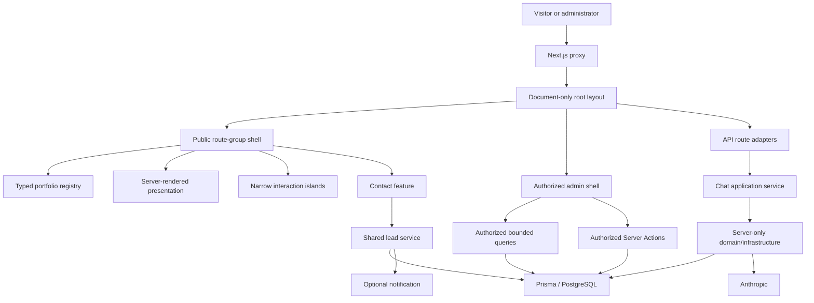

# Inside Dopamine — Product and Engineering Requirements

**Document status:** Active canonical PRD

**Phase One:** COMPLETE

**Phase Two:** COMPLETE

**UI/UX redesign readiness:** READY

**Release status:** Engineering Complete — Production Launch Pending

**Current dependency baseline:** Next.js 16.2.11, React/React DOM 19.2.8, Prisma ORM/Client/PostgreSQL adapter 7.9.0

**Production readiness:** BLOCKED by [CLEAN.md](CLEAN.md)

## 1. Product purpose

Inside Dopamine is the flagship proof that the team can build dependable digital products, transform product data into business intelligence, and create growth systems that bring those products customers.

The platform should present three connected capabilities:

| Capability | Evidence presented |
| --- | --- |
| Product and application development | Web applications, booking/operations systems, automation, AI products, and technical case studies |
| Business intelligence | Dashboards, reporting systems, analytical models, and decision-support work |
| Growth and acquisition | Google Ads strategy, campaign execution, optimization, and attributable commercial outcomes |

The positioning remains:

> We build the product, transform its data into business intelligence, and create the growth system that brings customers to it.

The application is improved incrementally. A framework rewrite is not justified. The App Router, Server Component foundation, strict TypeScript setup, design language, Prisma access pattern, typed portfolio content, and tested Phase One contracts should be preserved unless evidence supports a targeted change.

## 2. Users and journeys

### Prospective client

1. Understand the team’s capabilities and approach.
2. Browse services and case studies.
3. Ask the assistant a question without giving the browser control of canonical conversation history.
4. Request follow-up through chat or submit the contact form.
5. Receive success only after one durable lead outcome exists; otherwise retain entered information and receive a truthful recovery path.

### Administrator

1. Authenticate through the interim protected admin boundary.
2. View and manage leads, FAQs, and conversations.
3. Perform every sensitive read or mutation through point-of-use server authorization.
4. Navigate bounded, deterministic lead and conversation lists without loading full detail records.
5. See durable lead-notification outcomes without exposing full records unnecessarily.

### Engineering and business owners

1. Extend Product Engineering, Business Intelligence, and Growth content from one typed registry without duplicating route or domain logic.
2. Run local and CI checks without production services or personal data.
3. Preserve clear route, feature, client, server, and design-system ownership.
4. Release only after explicit dependency, privacy/lifecycle, and hosting-trust gates close.

## 3. Product and engineering requirements

### Public experience

- Preserve a coherent responsive portfolio with one semantic main landmark and stable navigation/chrome.
- Keep public chrome out of admin routes and admin chrome out of public routes.
- Preserve all existing public URLs, metadata, redirects, canonical URLs, and sitemap projections.
- Keep service and case-study content factual, maintainable, and extensible through stable `product`, `bi`, and `growth` category keys.
- Present validation, dependency failure, quota rejection, and success as distinct states.
- Do not claim a booking, callback, receipt, or response deadline unless the corresponding operational commitment exists.
- Preserve form values after failure and clear them only after durable success.

### Chat and lead integrity

- The server owns canonical user/assistant history; decorative client greetings are never provider history.
- Provider input is constructed authoritatively on the server and begins with a real user message.
- Input, identifiers, history, and request bytes are strictly bounded.
- Provider calls use explicit deadlines, zero automatic retries, and bounded in-process concurrency.
- Chat and contact use one lead service with source, trace ID, idempotency key, optional conversation relation, and durable notification state.
- Lead persistence precedes optional notification. Duplicate requests return the existing durable result rather than creating a second lead or notification.
- Transcript updates use stored-message idempotency and optimistic concurrency.
- Every persisted transcript change maintains `Conversation.messageCount`; the count is never accepted from the browser.
- The public chat route remains an HTTP adapter; the server-only chat application service owns use-case orchestration.

### Administration and security

- The proxy is an outer Basic Auth challenge, not the sole authorization control.
- Every sensitive admin read and exported Server Action authorizes before validation, logging, cache revalidation, or Prisma access.
- Missing/unsafe admin configuration fails closed; unauthorized behavior does not disclose record existence.
- Protected admin pages remain dynamic and uncached.
- Admin collection reads are cursor-bounded, deterministically ordered, and represented by narrow DTOs. Full records and transcripts belong to detail routes.
- Administration must run behind verified HTTPS/HSTS. Individual identities, expiry, revocation, MFA, RBAC, and attribution remain the target design.
- Public write/AI endpoints require strict schemas, actual UTF-8 byte limits, primary client and secondary session quotas where applicable, safe typed errors, request IDs, and `no-store` responses.

### Data, configuration, and operations

- PostgreSQL through Prisma is the source of truth for leads, conversations, FAQs, segment events, and notification state.
- Runtime configuration is validated by server-only modules; no secret-bearing or privileged module may enter a client dependency graph.
- `DATABASE_URL` and `DIRECT_URL` must identify the same explicitly isolated target before migration work.
- FAQ replacement requires the exact acknowledgement in every environment and runs atomically.
- Logs and customer responses contain stable codes, categories, statuses, timings, and request IDs—not credentials, provider bodies, transcripts, lead PII, or raw database errors.
- Production uses a distributed limiter and a proxy-overwritten trusted client address. Local in-memory results do not prove production topology.

## 4. Phase One final state

Phase One established the engineering safety foundation without production access, a production deployment, or a public redesign.

| Completion criterion | Final state |
| --- | --- |
| Patched framework/provider baseline | Complete. Next.js and matching lint configuration are 16.2.11; Anthropic SDK is 0.91.1. |
| Point-of-use admin authorization | Complete. Protected reads and exported admin actions authorize before sensitive work. |
| Public endpoint protection | Complete in code/local tests. Schemas, byte limits, quotas, deadlines, zero provider retries, stable errors, and redacted diagnostics are implemented. |
| Truthful durable lead behavior | Complete. Contact and chat share one idempotent database-first lead contract; notification state is separate. |
| Server-authoritative chatbot | Complete. Canonical history, optimistic persistence, safe output replacement, failure contracts, and browser recovery are covered. |
| Environment and seed safety | Complete. A value-free environment contract and atomic, acknowledgement-gated FAQ replacement exist. |
| Database change safety | Complete for engineering closure. Exact repository-order migrations, retained representative rows, rollback, roll-forward, indexes, constraints, relations, and uniqueness/idempotency passed in a removed temporary schema. |
| Configured integration proof | Complete for engineering closure. One durable contact and exactly one bounded real Anthropic request passed in the isolated environment. |
| Quality foundation | Complete. CI definition, 148 Phase One tests across 12 files, clean typecheck/lint/build/Prisma validation, secret scan, and representative browser regression evidence existed at closure. |
| Launch-blocking semantic contrast | Complete for the audited tokens and disabled controls. |

**Formal Phase One status: Engineering Complete — Production Launch Pending.**

The historical 148-test Phase One baseline remains evidence for that phase. Phase Two closed with 214 tests across 20 files; the subsequent production cleanup and dependency modernization increased the current repository baseline to 221 tests across 21 files.

## 5. Phase Two final state

Phase Two refined ownership and rendering without changing public design, URLs, copy, APIs, authentication, lead semantics, provider/model configuration, or Phase One contracts.

| Phase Two objective | Final state and implementation |
| --- | --- |
| Public/admin shell separation (H-01) | Complete. `src/app/layout.tsx` is document-only; `(public)/layout.tsx` and `admin/layout.tsx` independently own their chrome and semantic main. URLs and metadata inheritance are preserved. |
| Typed portfolio taxonomy (H-02) | Complete. `src/data/portfolio.ts` owns stable category keys, services, route/card/navigation projections, case-study relations, and contact enquiry options. |
| Case-study route consolidation (H-03) | Complete. One `[slug]` route owns all three known detail URLs, metadata, static params, 404 behavior, related work, and sitemap projection. |
| Design-system foundation (H-05) | Complete for the foundation. Tailwind v4 remains CSS-first; semantic tokens, named widths, normalized primitives, and public/admin reference surfaces are authoritative. Deprecated aliases remain intentionally tracked for gradual migration. |
| Static presentation boundaries (H-04) | Complete for the defined scope. Nine stable presentation components render as Server Components; equivalent reveal intent moved to CSS with reduced-motion behavior. |
| Server-first admin loading (M-03) | Complete. Conversation lists and initial FAQ DTOs load on the server. FAQ editing remains a narrow client island with mutation-returned data and revalidation. |
| Bounded admin reads (M-02) | Complete. Lead/conversation lists use stable `(createdAt, id)` cursors, default 25, maximum 50, one-extra-row page detection, narrow selections, and accessible server-rendered navigation. |
| Durable conversation summary | Complete. `messageCount` is backfilled and constrained to transcript JSON length; every chat create/update maintains it with optimistic versioning. List queries no longer select full transcripts. |
| Contact ownership (M-04) | Complete. Contact composition, client contract, client form, and server action live under `src/features/contact`; shared UI no longer imports route modules. |
| Next.js route contracts | Complete. Route-only exports remain in route modules; reusable parsers live in adjacent protected helpers; App Router page props match the current contract. |
| Chat application service (M-01) | Complete. The route owns HTTP parsing/metadata/response mapping; `src/features/chat/server` owns orchestration, policy, persistence, and typed results. |
| Server-module boundaries (M-06) | Complete. Privileged modules declare `server-only`, mixed HTTP/core helpers are split, client-safe contracts are dependency-free, and static dependency tests prevent reverse imports and client reachability. |

**Formal Phase Two status: Architecture Refinement Complete — Ready for UI/UX Redesign.**

This status is architectural. It does not close the production launch gates in [CLEAN.md](CLEAN.md).

## 6. Current architecture and ownership



Current ownership:

- `src/app/layout.tsx` owns only the HTML document, font, global stylesheet, and inherited root metadata.
- `src/app/(public)` owns public routes and public shell composition without changing URLs.
- `src/app/admin` owns the protected admin shell, route pages, route-specific authorized queries/actions, and detail rendering.
- `src/app/api` owns HTTP request parsing, metadata extraction, and response mapping only.
- `src/data/portfolio.ts` owns the client-safe Product Engineering, Business Intelligence, and Growth taxonomy and projections.
- `src/data/caseStudies.ts` owns case-study copy; one dynamic route owns detail rendering.
- `src/features/contact` owns contact presentation/interaction/contracts/actions.
- `src/features/chat/server` owns chat orchestration and persistence policy.
- `src/lib/lead-service.ts` owns the durable shared lead transaction.
- `src/lib/server/public-api-core.ts` owns transport-neutral server diagnostics/errors; `src/lib/public-api.ts` owns Next.js responses.
- `src/styles/globals.css` owns the Tailwind v4 CSS-first design system.
- `prisma` owns schema, reviewed migrations, and guarded FAQ replacement.

## 7. Accepted architecture decisions

### AD-001 — Interim and target administrator authentication

Phase One retains shared HTTP Basic Auth as an interim compatibility boundary. Credentials are server-only, validated at request time, compared through fixed-length timing-safe digests, and fail closed. The proxy provides the outer challenge; it never supplies implicit authorization to sensitive work.

Admin must be served only over verified HTTPS/HSTS, with a rotation and emergency lockout process. The remaining target design uses individual identities, short-lived secure sessions, expiry, revocation, audit attribution, least-privilege RBAC, MFA, and durable authentication-attempt controls.

### AD-002 — Authorization at the point of use

Every exported admin Server Action and protected data read calls the server-only authorization boundary before validation, logging, revalidation, or Prisma access. The admin layout also checks as defense in depth. Unauthorized requests do not query whether a record exists.

### AD-003 — Server environment contract

Configuration is read through protected server modules at the feature boundary. Critical features fail closed with typed operational errors; optional notification and absent metadata configuration degrade deliberately. `.env.example` lists names and safe descriptions without values. Only the canonical public site origin uses `NEXT_PUBLIC_*`.

### AD-004 — Lead persistence and notification

Contact and chat use one normalization and persistence service. Each request carries a correlation ID and client idempotency key; chat leads retain their conversation relation. Lead persistence commits before notification is attempted. Notification failure cannot erase a Lead, while database failure can never return customer success.

A durable outbox/retry worker remains future operational work.

### AD-005 — Public endpoint protection and quota identity

Public JSON handlers require the intended method/content type, reject unknown fields, enforce actual byte and field limits, and return stable safe errors. Paid work has explicit deadlines, zero retries, and bounded per-process concurrency.

Production requires a complete distributed Redis configuration and a verified proxy-overwritten identity. Development/test may use a bounded in-memory limiter.

### AD-006 — Route-group shell ownership

The root layout is document-only. The `(public)` route group exclusively owns public chrome and the public main; `admin/layout.tsx` exclusively owns protected admin chrome and the admin main. Route groups preserve public URLs and metadata inheritance.

### AD-007 — Canonical portfolio and case-study ownership

The client-safe portfolio registry owns stable category/service/route/projection identities. Case-study copy remains in the typed case-study data module, while one dynamic route owns every case-study detail URL. Metadata and sitemap output project from these owners.

### AD-008 — CSS-first design-system authority

Tailwind CSS 4 and `src/styles/globals.css` are the only theme configuration path. Semantic tokens, named widths, and domain-neutral primitives are preferred over raw repeated values. Compatibility aliases are explicitly deprecated and removed only after consumer migration and visual verification.

### AD-009 — Server-first rendering and hydration

Stable content renders on the server. A client boundary is permitted only for browser state, event-driven interaction, or runtime motion that cannot be represented safely in CSS. CSS presentation reveals preserve reduced-motion behavior without hydrating stable content.

### AD-010 — Bounded admin collection reads

Lead and conversation lists use deterministic composite cursors, a default page size of 25, a hard maximum of 50, narrow selections, and server-rendered navigation. Full lead details and transcript JSON are detail-only. `messageCount` is maintained transactionally with transcript writes and protected by a database constraint.

### AD-011 — Feature-owned contact and chat orchestration

Contact owns a client-safe contract, server composition, narrow client form, and protected Server Action. Chat owns a server-only application service, policy, and persistence helper behind a thin HTTP adapter. Neither feature depends on a route implementation.

### AD-012 — Explicit server-only dependency boundaries

Database, private environment, provider, authentication, request, notification, persistence, quota, and rate-limit modules declare `server-only` or a Server Action directive. Client-safe contracts contain no Prisma, Node, request API, provider, private configuration, or server implementation dependency. Static tests enforce the graph.

### AD-013 — Prisma 7 generated-client and connection ownership

Prisma CLI and Client remain on the same exact stable release. The `prisma-client` generator writes an ignored CommonJS-compatible TypeScript client to `src/generated/prisma`, allowing the existing guarded `ts-node` seed command to remain unchanged while Next.js bundles server imports. `postinstall` regenerates the client.

`prisma.config.ts` owns the direct migration connection through `DIRECT_URL`; `src/lib/prisma.ts` owns a lazy server-only `@prisma/adapter-pg` client using pooled `DATABASE_URL`. This dependency migration changes no model, table, index, constraint, migration history, seed policy, or runtime repository contract.

## 8. Server/client and performance strategy

### Hydration strategy

The default is:

```text
server route/layout
  -> server-rendered composition
    -> smallest stateful client island
```

The following remain intentionally client-side: navigation state, page transition, scroll control, services accordion, contact form state, chat interaction, and FAQ editing. Static homepage sections, work cards, page heroes/CTAs, case studies, admin conversation lists, and initial FAQ data render on the server.

Protected admin data is `force-dynamic` and uncached. Public registry data is static and build-time friendly. Suspense is not added to static content merely as an architectural pattern; it should be used only for a genuinely independent slow server region with a useful fallback.

The `/services` route still uses request headers for personalisation. Its ownership/value must be decided before changing its caching behavior.

### Pagination strategy

Admin lead and conversation pagination is server-rendered and cursor-based. Cursors contain the deterministic `(createdAt, id)` boundary, default to 25 records, and are capped at 50. Queries fetch one extra row to determine navigation, preserve active filters in links, and fall back safely for invalid cursors. Infinite scrolling is not part of the accepted admin pattern. List DTOs remain narrow, while full lead details and transcripts are confined to authorized detail routes.

## 9. Design-system strategy

The authoritative system defines:

- semantic base and status colors;
- display, hero, title, heading, subheading, body, caption, and label typography roles;
- named spacing/section rhythm;
- radii and elevation;
- fast/base/slow/slower motion values and shared easing;
- focus, error, disabled, and interaction states;
- `narrow`, `standard`, `wide`, and `admin` content widths.

The normalized primitive set is deliberately small. Feature compositions remain outside `src/components/ui`. Public contact and admin FAQ/status/layout surfaces demonstrate adoption without constituting a redesign. Deprecated CSS aliases remain compatibility-only and must not be used by new normalized primitives.

## 10. Data lifecycle requirements

The application currently handles:

- Lead identity, company/project details, preferences, source, trace, and notification relation;
- bounded conversation transcripts, durable message counts, and optional chat lead identity;
- bounded segment/source/intent/path events;
- pseudonymized quota identity, request IDs, and redacted operational metadata.

Before production personal-data collection, the business/privacy owner must approve controller/contact details, purposes/legal bases, processors and transfers, retention periods, public notices/terms, and backup/legal-hold behavior. Backend Operations must implement access/export/deletion and automated expiry, rehearse them with synthetic linked records, log counts rather than contents, and verify platform log/Redis retention. These requirements remain [PRIV-001](CLEAN.md#priv-001--privacy-and-data-lifecycle).

## 11. Remaining Phase Three roadmap

Phase Three contains the previously discussed work that was not part of the Phase Two architecture completion:

1. Implement the flagship public UI/UX redesign and add factual Product, BI, and Growth evidence.
2. Decide whether personalisation/recommendation has a measured product owner; remove orphaned paths if it does not.
3. Remove verified dead presentation experiments, finish motion-policy consistency, and retire compatibility aliases as redesigned surfaces migrate.
4. Consolidate repeated service-detail compositions only after route/content characterization.
5. Replace interim shared admin credentials with individual identity, secure sessions, expiry/revocation, MFA/RBAC, attribution, and durable auth throttling.
6. Add cross-instance AI-call reservation, stronger grounded-output controls, and adversarial AI evaluation.
7. Add notification outbox/retry, health/readiness, metrics, alerts, backup/rollback automation, and live release evidence.
8. Complete broader focus/keyboard/announcement/reduced-motion accessibility and the already-defined performance, SEO, social metadata, sitemap-date, CSP/HSTS, and internal-navigation work.
9. Implement privacy lifecycle controls after policy approval.
10. Close all production launch gates in [CLEAN.md](CLEAN.md).

## 12. Non-goals and engineering principles

- Do not rewrite the application merely to modernize its appearance.
- Do not let the browser or model decide whether a privileged action, booking, or lead succeeded.
- Establish behavioral coverage before risky route, persistence, authentication, or component restructuring.
- Prefer one owner per concern and explicit failure behavior.
- Never use production services or personal data for ordinary tests.
- Redact diagnostics by default and never place secrets or full sensitive payloads in reports.
- Extend abstractions only when they correspond to demonstrated Product, BI, or Growth needs.
- Do not add generic repositories, dependency-injection frameworks, or component frameworks without a concrete use case.

The governing product question remains:

> Does this make Inside Dopamine more dependable and convincing as proof that this team can build, understand, and grow a real business?
