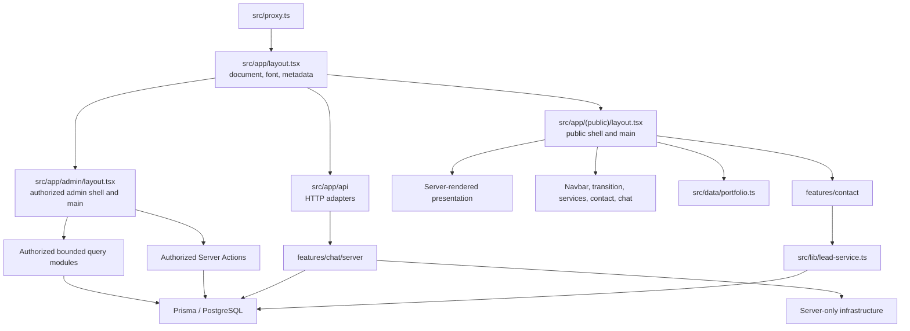

# Inside Dopamine

Inside Dopamine is a Next.js App Router portfolio platform with public service and case-study pages, an Anthropic-backed assistant, durable contact/chat lead capture, visitor personalisation events, and a protected Prisma/PostgreSQL administration area.

## Project status

- **Phase One:** COMPLETE — engineering safety and correctness foundation
- **Phase Two:** COMPLETE — architecture refinement and design-system foundation
- **UI/UX redesign readiness:** READY
- **Release status:** Engineering Complete — Production Launch Pending
- **Production readiness:** BLOCKED by the three launch gates in [CLEAN.md](CLEAN.md)
- **Current verified quality baseline:** 21 test files / 221 tests, plus passing TypeScript, ESLint, Prisma 7 validation/generation, and the explicit Webpack production build

Phase Two did not redesign the application or close production-only business, privacy, dependency, or hosting gates. The current implementation record is in [AUDIT.md](AUDIT.md), and the remaining launch requirements are maintained in [CLEAN.md](CLEAN.md).

## Current architecture



The root layout is document-only. The `(public)` route group preserves every public URL while exclusively owning `Navbar`, `Footer`, `PageTransition`, `ScrollToTopButton`, `ChatWidget`, and the public `<main>`. The protected admin layout exclusively owns the admin header, navigation, content width, and admin `<main>`. Each rendered surface therefore has one semantic main landmark and never receives the other surface’s chrome.

All three case-study URLs are owned by `src/app/(public)/work/[slug]/page.tsx`. Static parameters, metadata, canonical/Open Graph URLs, related work, sitemap projection, and unknown-slug behavior are derived from typed data rather than duplicate explicit routes.

## Canonical folder structure

```text
src/
  app/
    layout.tsx                       # document, font, root metadata only
    (public)/
      layout.tsx                     # public shell and public main
      page.tsx
      about/ contact/ process/
      services/ work/
      privacy/ terms/
    admin/
      layout.tsx                     # authorization, admin shell, admin main
      leads/                         # server page, bounded query, actions, detail
      conversations/                 # server page, bounded query, detail
      faqs/                          # server page plus client editor island
    api/                             # thin HTTP route adapters
    sitemap.ts
    robots.ts
  components/
    layout/                          # reusable shell components
    sections/                        # public presentation compositions
    ui/                              # domain-neutral primitives and widgets
  data/
    portfolio.ts                     # typed Product / BI / Growth registry
    caseStudies.ts                   # canonical case-study content
  features/
    contact/
      contract.ts                    # client-safe fields, options, state
      components/                    # server composition and client form
      server/action.ts               # authoritative Server Action
    chat/server/
      chat-service.ts                # chat application orchestration
      chat-policy.ts
      chat-types.ts
      conversation-repository.ts
  lib/
    server/public-api-core.ts        # transport-neutral server errors/logging
    public-api.ts                    # Next.js response construction
    admin-auth*.ts
    admin-pagination.ts
    ai.ts env.ts lead-service.ts
    prisma.ts rate-limit.ts
  generated/prisma/                   # ignored Prisma 7 client; postinstall output
  styles/globals.css                 # authoritative Tailwind v4 CSS-first system
prisma/
  schema.prisma
  migrations/
prisma.config.ts                       # Prisma 7 CLI datasource/migration/seed ownership
tests/
```

This is an ownership map, not a rule that every domain needs a feature folder. Route-colocated admin queries/actions remain appropriate because they have one route-family owner. `src/data/portfolio.ts` remains the canonical client-safe registry; moving it only for naming symmetry is not justified.

## Ownership and boundaries

### Feature ownership

- `src/data/portfolio.ts` owns stable category keys (`product`, `bi`, `growth`), service definitions, route projections, navigation/card projections, case-study relations, and contact enquiry options.
- `src/data/caseStudies.ts` owns existing case-study copy and typed case-study records.
- `src/features/contact` owns contact composition, the browser-safe contract, the narrow interactive form, and the Server Action. Static contact copy, trust content, sidebar content, and FAQs render on the server.
- `src/features/chat/server` owns chat use-case orchestration, provider-message policy, conversation persistence, optimistic concurrency, and typed outcomes.
- `src/lib/lead-service.ts` remains the single server-only lead transaction shared by contact and chat.
- Admin route folders own authorized, narrow, bounded reads and route-specific mutations.

### Server, client, and hydration boundaries

Server Components are the default. Stable copy, cards, lists, page heroes, calls to action, work indexes, case-study content, admin lists, and initial FAQ data render on the server.

Intentional client islands are limited to stateful behavior:

- responsive/scroll-aware navigation;
- public page transition and scroll-to-top control;
- services accordion;
- contact form state, pending feedback, and success reset;
- chat widget, messages, and lead-capture interaction;
- FAQ editing and mutation feedback;
- legacy or currently unused motion experiments awaiting cleanup.

Protected data remains dynamic and uncached. Client components may import only client-safe contracts, DTOs, constants, data projections, and UI modules. They must not reach Prisma, private configuration, authentication, request APIs, providers, notification code, persistence, quotas, or Server Actions through a shared import.

### Dependency direction

```text
routes and Server Actions
  -> feature services / authorized route queries
    -> domain policy and persistence helpers
      -> server-only infrastructure
        -> Prisma, Next.js server APIs, providers

client components
  -> client-safe contracts / registry projections / UI
```

Shared and feature modules do not import from `src/app`. Feature services do not depend on route modules. Infrastructure does not import UI. General-purpose barrels may export domain-neutral UI or client-safe contracts only; server implementations use explicit imports.

## Design system

Tailwind CSS 4 remains CSS-first. `src/styles/globals.css` is the authoritative source for:

- semantic color and status tokens;
- typography roles and tracking;
- spacing and section rhythm;
- radii and elevation;
- motion durations/easing;
- focus and interaction states;
- named content widths: `narrow`, `standard`, `wide`, and `admin`.

`src/app/globals.css` is only the App Router import bridge. The obsolete `tailwind.config.ts` was removed after build verification.

The domain-neutral primitive set includes `Button`, `Card`, `Badge`, `StatusBadge`, `Input`, `Textarea`, `Select`, `Field`, `Section`, `Container`, and `Divider`. Public contact and admin FAQ/status/layout surfaces are the reference migrations. Clearly marked compatibility aliases remain for untouched surfaces and should be removed only after their consumers migrate and visual checks pass.

Static presentation reveal behavior is CSS-driven with a visible fallback and a reduced-motion override. Runtime motion remains only where interaction or legacy presentation genuinely requires a client boundary.

## Architecture principles

1. One canonical owner per shell, route, taxonomy, contract, and use case.
2. Server rendering by default; hydrate only stateful controls.
3. Point-of-use authorization before every sensitive read or mutation.
4. Narrow DTOs and bounded collection queries; full records belong to detail views.
5. Server-authoritative validation, chat history, provider input, lead success, quotas, and persistence.
6. Static registries project into UI, metadata, redirects, and sitemap rather than being copied.
7. Domain-neutral UI stays free of feature and route dependencies.
8. Server-only modules declare their boundary explicitly.
9. Preserve Phase One request, security, truthfulness, idempotency, and failure contracts.
10. Add abstractions only for demonstrated Product, BI, or Growth needs.

## Installation

Requirements:

- Node.js 20.19.0 or newer (Node.js 22 is the CI/deployment recommendation)
- npm
- PostgreSQL for database-backed features

Install the locked dependency graph:

```bash
npm ci
```

`postinstall` generates the Prisma 7 client into ignored `src/generated/prisma`. Regenerate it explicitly with `npm run prisma:generate` when the schema or Prisma version changes. Runtime queries use `@prisma/adapter-pg` with the pooled `DATABASE_URL`; Prisma CLI migration commands use the direct `DIRECT_URL`.

## Environment setup

Copy the value-free example into an ignored local file and add development-only values:

```bash
cp .env.example .env.local
```

Never commit, print, or reuse production credentials for local work.

| Variable | Requirement |
| --- | --- |
| `DATABASE_URL` | Pooled PostgreSQL URL for database-backed runtime features. |
| `DIRECT_URL` | Direct PostgreSQL URL for Prisma validation/migrations; it must identify the same isolated database and branch as `DATABASE_URL`. |
| `ADMIN_USERNAME`, `ADMIN_PASSWORD` | Interim admin credential pair. Missing or invalid values fail closed; password length is 16–256 characters. |
| `ANTHROPIC_API_KEY` | Required only for real chat/recommendation provider calls. |
| `ANTHROPIC_MODEL` | Optional bounded model override; blank uses the server default. |
| `UPSTASH_REDIS_REST_URL`, `UPSTASH_REDIS_REST_TOKEN` | Preferred complete production pair for distributed public quotas. |
| `KV_REST_API_URL`, `KV_REST_API_TOKEN` | Supported complete fallback pair for the same quota store. |
| `RATE_LIMIT_IDENTITY_SECRET` | Required in production to pseudonymize quota identities; length is 32–256 characters. |
| `CONTACT_INBOX_WEBHOOK_URL` | Optional HTTPS notification destination. Lead persistence remains authoritative when notification is unavailable. |
| `NEXT_PUBLIC_SITE_URL` | Public canonical origin. Local HTTP is accepted only outside production; production requires HTTPS. |
| `FAQ_SEED_PRODUCTION_ACKNOWLEDGEMENT` | Empty by default; destructive FAQ replacement requires the exact guarded value below. |

`prisma.config.ts` loads ignored `.env.local` first and `.env` second without overriding variables already supplied by the shell or deployment platform. It never copies database URLs into the schema or browser configuration.

## Development workflow

1. Start from the relevant canonical document and identify the owning route, feature, registry, or infrastructure module.
2. Add or update characterization tests before changing route ownership, persistence, authorization, public contracts, or compatibility aliases.
3. Keep new route entries and stable presentation server-rendered unless browser state is required.
4. Import server implementations explicitly and keep browser contracts dependency-free.
5. Run focused tests while iterating, then the full quality sequence before handoff.

Start the default development server:

```bash
npm run dev
```

If `NEXT_PUBLIC_SITE_URL` uses another local port, pass the matching port to Next.js:

```bash
npm run dev -- -p 3000
```

Local/test public quotas use a bounded in-memory limiter. This validates request behavior but does not prove distributed production enforcement.

## Testing and build workflow

The scripts in `package.json` are authoritative:

| Command | Purpose |
| --- | --- |
| `npm run typecheck` | Strict TypeScript validation. |
| `npm run lint` | Full ESLint gate. |
| `npm test` | Run all Vitest tests once. |
| `npm run build` | Create the production Next.js build; `postbuild` checks browser-facing artifacts for the synthetic secret marker. |
| `npm run build -- --webpack` | Exercise the explicit Webpack production path used for offline local validation. |
| `npm run secret:scan` | Scan source, reachable history, public files, browser artifacts, manifests, and source maps for credential signatures. |
| `npm run prisma:generate` | Regenerate Prisma Client. |
| `npm run prisma:migrate` | Apply pending migrations to the configured target; approved release use only. |
| `npm run start` | Start an already-built production server. |

Recommended non-destructive local sequence:

```bash
npm run typecheck
npm run lint
npm test
npx prisma validate
npx prisma generate
npm run build
git diff --check
```

When intentionally editing `prisma/schema.prisma`, run `npx prisma format` before validation; it rewrites the schema in place.

Release-only checks also include:

```bash
npm audit --omit=dev --audit-level=high
npm run secret:scan
```

The dependency audit remains a deliberate production gate; do not lower the threshold or use an automatic audit fix to conceal [DEP-01](CLEAN.md#dep-01--dependency-disposition). No default test or build command calls a paid provider, sends a webhook, seeds data, or accesses production.

## Database migrations and FAQ replacement

Admin lead and conversation lists use deterministic `(createdAt, id)` cursors, a default page size of 25, and a hard maximum of 50. Queries fetch one extra row to derive page navigation and select list DTO fields only. Full lead data and full conversation transcripts remain confined to detail routes.

`Conversation.messageCount` is a durable list-level summary. The reviewed Phase 2.3C migration backfills existing JSON arrays, adds a database equality constraint, and adds the composite cursor index. Every chat transcript create/update writes the transcript and count together; optimistic versioning remains authoritative. Do not derive the count from browser input.

`npm run prisma:migrate` runs `prisma migrate deploy` against the configured target. Before using it, independently confirm the target, backup/roll-forward plan, authorization, and pooled/direct same-target pairing.

FAQ replacement is atomic and destructive. Every execution is blocked unless `FAQ_SEED_PRODUCTION_ACKNOWLEDGEMENT` exactly equals:

```text
I_UNDERSTAND_THIS_REPLACES_ALL_FAQS
```

The acknowledgement does not prove a target is safe. Never run the seed without separate target verification and authorization.

## Current roadmap

### Phase One — complete

Security/correctness foundations, truthful durable lead handling, server-authoritative chat, migration safety, environment validation, and the original regression baseline are complete.

### Phase Two — complete

Route-shell separation, case-study consolidation, typed portfolio ownership, design-system authority, static Server Component migration, server-first admin loading, bounded admin pagination, durable conversation counts, contact ownership, chat application-service extraction, route-contract repair, and server-module boundary checks are complete.

### Remaining Phase Three work

- Implement the flagship visual redesign and add factual Product, BI, and Growth evidence without weakening current ownership.
- Decide whether the current personalisation/recommendation path has a measured product owner; otherwise remove it with tests.
- Remove verified dead presentation experiments and finish the motion/compatibility-alias cleanup as affected surfaces migrate.
- Consolidate repeated service-detail compositions only after route/content characterization.
- Continue the already-defined identity, privacy/lifecycle, cross-instance quota/provider reservation, notification outbox, observability, accessibility, performance, SEO/social metadata, and hosting-header work.
- Close DEP-01, PRIV-001, and RATE-IDENTITY-01 before any production launch.

## Documentation index

- [README.md](README.md) — setup, current architecture, workflows, principles, and status
- [PRD.md](PRD.md) — unchanged business goals, completed phases, accepted architecture decisions, and remaining roadmap
- [AUDIT.md](AUDIT.md) — current evidence, resolved/partial/open findings, risks, and technical debt
- [ARCHITECTURE_REVIEW.md](ARCHITECTURE_REVIEW.md) — Phase 2.0 recommendation status, current architecture score, and redesign-readiness verdict
- [CLEAN.md](CLEAN.md) — repository ownership/cleanliness rules and unresolved production-launch gates
- [CHANGELOG.md](CHANGELOG.md) — chronological Phase One and Phase Two implementation record

## Deployment boundary

Production deployment remains prohibited until every gate in [CLEAN.md](CLEAN.md) is closed and recorded. Do not use `prisma db push`, `prisma migrate reset`, an unreviewed seed, or production credentials as a substitute for the approved release process.

For an authorized future release:

1. Use the changed `package-lock.json` with `npm ci` on Node.js 22 (minimum supported: 20.19.0). `postinstall` runs `prisma generate` automatically.
2. Keep every existing environment-variable name. This dependency migration adds none; confirm `DATABASE_URL` remains pooled and `DIRECT_URL` remains the non-pooled connection to the same target.
3. This Prisma 7 migration changes no data model and creates no migration. Run `npx prisma migrate deploy` only when repository migrations are actually pending; because the application already expects the Phase 2.3C schema, apply any pending reviewed migrations before deploying the application revision.
4. Deploy the exact tested revision only after dependency, privacy/lifecycle, rate-identity, backup, and rollback gates close.
5. Immediately verify public routes, the admin challenge and authorized reads, contact/chat safe success and dependency-failure paths, personalisation/recommendation/segment APIs, database connectivity, browser console/hydration, logs, quotas, and the synthetic client-bundle scan.

Rollback this dependency-only change by redeploying the preceding lockfile/application revision so its own postinstall regenerates the Prisma 6 client. Do not reverse an already applied repository migration as part of that application rollback; use the reviewed roll-forward plan for database changes.
